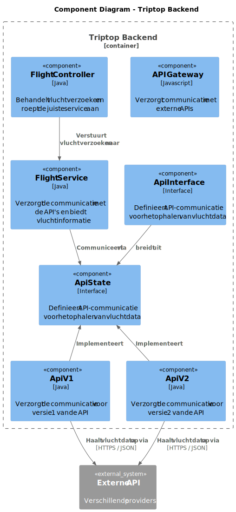

# Software Guidebook Triptop

## 1. Introduction

Dit software guidebook geeft een overzicht van de Triptop-applicatie. Het bevat een samenvatting van het volgende:

1. De vereisten, beperkingen en principes.
1. De software-architectuur, met inbegrip van de technologiekeuzes op hoog niveau en de structuur van de software.
1. De ontwerp- en codebeslissingen die zijn genomen om de software te realiseren.
1. De architectuur van de infrastructuur en hoe de software kan worden geinstalleerd.

## 2. Context

Context diagram van de Triptop applicatie:

Dit diagram toont de omgeving waarin Triptop zich bevindt. Triptop is een online systeem, wat communiceert met verschillende externe systemen.

### Functionaliteit

De Triptop applicatie biedt reizigers de volgende mogelijkheden:

1. Reizigers kunnen zelf hun reis samenstellen door verschillende bouwstenen te combineren.

2. Reizigers kunnen zelf hun reis aanpassen, boeken, betalen en annuleren.

3. Reizigers kunnen hun reisstatus bewaren.

### Gebruikers

Het systeem heeft twee soorten gebruikers, namelijk:

#### Reiziger

De reiziger is de primaire gebruiker van het systeem en heeft toegang tot bovenstaande functionaliteiten. De reiziger kan contact opnemen met de reisagent voor hulp bij vragen of problemen.

#### Reisagent

De reisagent is een medewerker van Triptop die de reiziger ondersteunt bij het plannen en aanpassen van de reis. De reisagent biedt tweedelijns ondersteuning, door bijvoorbeeld vragen te beantwoorden of risico-inschattingen te maken.

We hebben ervoor gekozen om de reisagent niet op te nemen in het context diagram, omdat de reisagent momenteel niet met het systeem communiceert. De reiziger communiceert voor nu telefonisch met de reisagent.

### Externe systemen

De Triptop applicatie maakt gebruik van verschillende externe systemen. We hebben nog geen keuze gemaakt voor de specifieke API's die we gaan gebruiken voor de verschillende bouwstenen. Hierom hebben we deze onderdelen opgenomen in het diagram als **Provider** van de bijpassende bouwstenen, zoals "Overnachtingprovider" en "Autoverhuurprovider".

Er is gekozen om nog geen betalingsprovider toe te voegen, omdat er gebruik gemaakt zal worden van affiliate marketing. Dit wordt toegelicht in ADR-001.

## 3. Functional Overview

Om de belangrijkste features toe te lichten zijn er user stories en twee domain stories gemaakt en een overzicht van het domein in de vorm van een domeinmodel. Op deze plek staat typisch een user story map maar die ontbreekt in dit voorbeeld.

### 3.1 User Stories

#### 3.1.1 User Story 1: Reis plannen

Als gebruiker wil ik een zelfstandig op basis van diverse variabelen (bouwstenen) een reis kunnen plannen op basis van mijn reisvoorkeuren (wel/niet duurzaam reizen, budget/prijsklasse, 's nachts reizen of overdag etc.) zodat ik op vakantie kan gaan zonder dat hiervoor een reisbureau benodigd is.

#### 3.1.2 User Story 2: Reis boeken

Als gebruiker wil ik een geplande reis als geheel of per variabele (bouwsteen) boeken en betalen zodat ik op vakantie kan gaan zonder dat hiervoor een reisbureau benodigd is.

#### 3.1.3 User Story 3: Reis cancelen

Als gebruiker wil ik een geboekte reis, of delen daarvan, kunnen annuleren zodat ik mijn geld terug kan krijgen zonder inmenging van een intermediair zoals een reisbureau.

#### 3.1.4 User Story 4: Reisstatus bewaren

Als gebruiker wil ik mijn reisstatus kunnen bewaren zonder dat ik een extra account hoef aan te maken zodat ik mijn reis kan volgen zonder dat ik daarvoor extra handelingen moet verrichten.

#### 3.1.5 User Story 5: Bouwstenen flexibel uitbreiden

Als gebruiker wil ik de bouwstenen van mijn reis flexibel kunnen uitbreiden met een zelf te managen stap (bijv. met providers die niet standaard worden aangeboden zoals een andere reisorganisatie, hotelketen etc.) zodat ik mijn reis helemaal kan aanpassen aan mijn wensen.

### 3.2 Domain Story Reis Boeken (AS IS)

### 3.3 Domain Story Reis Boeken (TO BE)

### 3.4 Domain Model

## 4. Quality Attributes

Voordat deze casusomschrijving tot stand kwam, heeft de opdrachtgever de volgende ISO 25010 kwaliteitsattributen benoemd als belangrijk:

- Compatibility -> Interoperability (Degree to which a system, product or component can exchange information with other products and mutually use the information that has been exchanged)
- Reliability -> Fault Tolerance (Degree to which a system or component operates as intended despite the presence of hardware or software faults)
- Maintainability -> Modularity (Degree to which a system or computer program is composed of discrete components such that a change to one component has minimal impact on other components)
- Maintainability -> Modifiability (Degree to which a product or system can be effectively and efficiently modified without introducing defects or degrading existing product quality)
- Security -> Integrity (Degree to which a system, product or component ensures that the state of its system and data are protected from unauthorized modification or deletion either by malicious action or computer error)
- Security -> Confidentiality (Degree to which a system, product or component ensures that data are accessible only to those authorized to have access)

## 5. Constraints

> [!IMPORTANT]
> Beschrijf zelf de beperkingen die op voorhand bekend zijn die invloed hebben op keuzes die wel of niet gemaakt kunnen of mogen worden.

## 6. Principles

> [!IMPORTANT]
> Beschrijf zelf de belangrijkste architecturele en design principes die zijn toegepast in de software.

## 7. Software Architecture

### 7.1. Containers

#### 7.1.1 Statische container diagram van de Triptop applicatie

Dit diagram beschrijft de architectuur van de Triptop applicatie en de interacties tussen de verschillende bouwstenen. De gebruikers van de applicatie zijn de reiziger en de reisagent.

De applicatie is opgebouwd uit verschillende containers. De frontend applicatie, gebouwd met React.js en Vite, is de interface waar de reiziger zijn reis kan samenstellen, boeken, aanpassen, annuleren en betalen. De backend is ontwikkeld met Java en Spring Boot en beheert de logica van de applicatie. De backend ontvangt verzoeken van de frontend en communiceert met de database, waarin alle gegevens over gebruikers en reizen worden opgeslagen. Verder is er een API Gateway, die als poort fungeert tussen de backend en de externe systemen. Deze keuze wordt toegelicht in ADR-004.

Daarnaast maakt de applicatie gebruik van verschillende externe systemen via de API Gateway. De Booking COM API biedt informatie over accommodaties, vluchten, autohuur en attracties. De Uber Eats API toont restaurants. Via de WireMock API wordt de identiteit van de reiziger geverifieerd door middel van Single Sign-On (SSO). Tot slot biedt de Maps Data API informatie over locaties. Voor het prototype wordt gebruik gemaakt van de Maps Data API. De Google Maps API, die daadwerkelijk routes en kaarten levert, werkt met een betaald model en is niet geschikt voor ontwikkeling zonder kosten.

In het containerdiagram is het aantal externe providers lager ten opzichte van het contextdiagram. Dit komt doordat de Booking COM API als primaire provider wordt gebruikt voor meerdere bouwstenen. Deze keuze is gemaakt om het aantal integraties te verlagen en wordt toegelicht in ADR-002.

De frontend applicatie communiceert met de backend, die de benodigde gegevens uit de database haalt en de externe systemen via de API Gateway aanroept om aanvullende informatie op te halen of handelingen uit te voeren, zoals het boeken van tickets of het verifiëren van de identiteit van de reiziger.

#### 7.1.2 Dynamisch container diagram voor Inloggen scenario

Dit diagram beschrijft de dynamische architectuur van de Triptop applicatie tijdens het inloggen van een reiziger. De reiziger start de authenticatie door zijn inloggegevens in te voeren op de frontend applicatie, die ontwikkeld is met React.js en Vite. De frontend stuurt vervolgens een authenticatieverzoek naar de WireMock API. Als de verificatie succesvol is, ontvangt de frontend een token van de WireMock API.

Met deze token stuurt de frontend een validatieverzoek naar de backend, die ontwikkeld is met Java en Spring Boot. De backend controleert de token en haalt de bijbehorende gegevens op uit de database. Na het ophalen van de gegevens stuurt de backend het resultaat van de inlogpoging terug naar de frontend. Als alles correct is verlopen, wordt de reiziger ingelogd en krijgt hij/zij toegang tot de applicatie.

Dit diagram toont alleen de happy path. Edge cases zijn momenteel nog niet in de scope en worden later behandeld.

#### 7.1.3 Dynamisch container diagram voor Reis boeken scenario

Dit diagram beschrijft de dynamische architectuur van de Triptop applicatie wanneer een reiziger een reis plant en boekt. De reiziger begint door een reis samen te stellen via de frontend applicatie, die ontwikkeld is met React.js en Vite. De frontend stuurt de ingevoerde reisgegevens door naar de backend, die ontwikkeld is met Java en Spring Boot.

De backend verwerkt deze gegevens en slaat de boeking op in de database. Zodra het opslaan van de data voltooid is, stuurt de backend een bevestiging terug naar de frontend. De frontend toont vervolgens de bevestiging aan de reiziger, die hiermee geïnformeerd wordt dat zijn/haar reis succesvol is geboekt.

Dit diagram toont alleen de happy path. Edge cases zijn momenteel nog niet in de scope en worden later behandeld.

### 7.2. Components

#### 7.2.1 Component diagram integriteit exteren API's

Dit componentendiagram toont de structuur van de Triptop backend en hoe de verschillende onderdelen samenwerken om API-communicatie betrouwbaar te verwerken.
De API Gateway is de kern van de backend en verwerkt API-verzoeken. Het implementeert de IApiClient-interface, die de standaard voor API-communicatie bepaalt. De API Gateway haalt data op en stuurt deze door naar externe APIs via HTTPS en JSON.
Om de kwaliteit van de gegevens te waarborgen, controleert de Validation Service alle inkomende en uitgaande data. Daarnaast registreert de Logging Service alle API-verzoeken, responses en versies, zodat deze later kunnen worden geanalyseerd.
De backend communiceert met verschillende externe APIs, bijvoorbeeld voor reis- of betalingsgegevens. Voordat data wordt verzonden, wordt deze eerst gevalideerd. De ontvangen response wordt gelogd en eventueel verder verwerkt.

#### 7.2.2 Dynamic diagram integriteit exteren API's

Dit dynamische componentendiagram laat zien hoe API-verzoeken door de Triptop backend worden verwerkt en welke stappen daarbij worden doorlopen.
De API Gateway stuurt een verzoek naar de ApiClient Interface. Dit verzoek bevat de benodigde gegevens en instructies om met een externe API te communiceren.
De ApiClient Interface stuurt het verzoek door naar de externe API en ontvangt een response via HTTPS in JSON-formaat.
Voordat de ontvangen data wordt verwerkt, controleert de Validation Service de data-integriteit. Dit voorkomt dat ongeldige of schadelijke gegevens het systeem binnenkomen.
De Validation Service stuurt een validatieresultaat terug naar de API Gateway. Dit is meestal een boolean (true of false) die aangeeft of de data correct is.
De API Gateway stuurt loggegevens naar de Logging Service. Hierin worden API-verzoeken, responses en versies vastgelegd voor traceerbaarheid.
De Logging Service bevestigt de logging-status aan de API Gateway. Dit helpt bij het monitoren van systeemactiviteit en bij het debuggen van mogelijke problemen.

#### 7.2.3 Component diagram Toevoegen van een nieuwe externe service

Dit diagram laat de componenten uit de back-end zien die betrokken zijn bij het ophalen van restaurantdata via de externe service. De structuur is ingericht volgens een [hexagonale architectuur](#keuze-1). De RestaurantService communiceert niet direct met de API-implementatieklasse, maar maakt gebruik van een port-interface (RestaurantPort) die wordt geïmplementeerd door een adapterklasse (UberEatsScraperAdapter).

De adapter is verantwoordelijk voor de communicatie met de externe Uber Eats API en zet de ontvangen data om naar de structuur van het domeinmodel. Binnen de adapter wordt het Template Method Pattern toegepast om de aanroep van de externe API te structureren. Dit houdt in dat de abstracte klasse, APICaller, de vaste stappen van de API-aanroep definieert.
Deze structuur wordt verder toegelicht in de paragraaf [Class diagram Toevoegen van een nieuwe externe service](#724-dynamic-diagram-toevoegen-van-een-nieuwe-externe-service).

Bovenstaand diagram is beperkt tot de aanroep van restaurantdata. Andere bouwstenen (zoals hotels of autoverhuur) volgen dezelfde structuur, maar zijn niet in dit diagram meegenomen. Om dit te verduidelijken hebben we een diagram gemaakt waar, als voorbeeld, een tweede externe restaurantservice (Tripadvisor) is toegevoegd en een externe hotelservice (Booking COM).

Om een tweede restaurantservice toe te voegen (feature bestaat al), hoeft er alleen een adapter voor de externe service aangemaakt te worden die de bestaande `RestaurantPort` implementeert en de APICaller extend. In `RestaurantService` hoeft geen code aangepast te worden en deze blijft gebruik maken van dezelfde `RestaurantPort`.
Om een hotelservice toe te voegen (nieuwe feature), moet er een `HotelController` en `HotelService` aangemaakt worden, met een eigen interface (HotelPort). Ook moet er een nieuwe adapterklasse (BookingCOMAdapter) gemaakt worden die deze interface implementeert en APICaller extend.

#### 7.2.4 Dynamic diagram Toevoegen van een nieuwe externe service

Dit diagram laat zien hoe de componenten samenwerken tijdens een runtime-scenario waarin de gebruiker restaurants opvraagt via de frontend. De service roept via de port de adapter aan, die vervolgens met de externe API communiceert. De interactie tussen de componenten is gebaseerd op de Ports en Adapters structuur en maakt gebruik van het Template Method Pattern om de stappen binnen de API-aanroep (zoals authenticatie en dataverwerking) te structureren. Dit diagram is beperkt tot de aanroep van restaurantdata. Andere bouwstenen (zoals hotels of autoverhuur) volgen dezelfde structuur, maar zijn niet in dit diagram meegenomen.

#### 7.2.5 Component diagram aanroepen van externe services die niet beschikbaar zijn

Dit component diagram toont de architectuur van het **Triptop** systeem, met name over de backend. De **Triptop Applicatie** stuurt verzoeken naar de backend, die bestaat uit meerdere componenten zoals de **EatsController**, **EatsService**, **EatsAdapter** en **EatsRepository**. Deze backend verwerkt API-aanvragen, beheert data en communiceert met externe systemen zoals de **UberEats API** en een **Redis Cache** voor tijdelijke opslag van restaurantgegevens.

Voor mijn ontwerp heb ik gekozen voor het **Strategy Pattern**. Dit patroon maakt het mogelijk om flexibel te schakelen tussen verschillende strategieën als de UberEats API tijdelijk niet beschikbaar is. Bijvoorbeeld, in plaats van een foutmelding te geven, kan de applicatie overschakelen op een caching-strategie met Redis.

Voor de meest passende principe koos ik voor de **Open/Closed Principle (OCP)**. Dit principe stelt dat softwarecomponenten open moeten zijn voor uitbreiding, maar gesloten voor modificatie. Dit sluit goed aan bij het Strategy Pattern, omdat nieuwe strategieën kunnen worden toegevoegd zonder bestaande code te wijzigen. Hierdoor blijft de architectuur flexibel en onderhoudbaar.

#### 7.2.6 Dynamic diagram aanroepen van externe services die niet beschikbaar zijn

Dit diagram laat stap voor stap zien hoe de Triptap Applicatie omgaat met een aanvraag voor restaurantgegevens. Het geeft een dynamisch beeld van hoe de verschillende onderdelen samenwerken om de juiste data op te halen.
Hoe werkt het?

1. De gebruiker vraagt gegevens op via de Triptap Applicatie (bijvoorbeeld een lijst met restaurants).

2. EatsController ontvangt de aanvraag en stuurt deze door naar EatsService.

3. EatsService controleert eerst of de gegevens al in de cache (EatsRepository / Redis Cache) staan.

4. Als de gegevens in de cache staan, worden ze direct teruggestuurd.

5. Als de gegevens niet in de cache staan, haalt EatsAdapter ze op bij de UberEats API.

6. De opgehaalde gegevens worden opgeslagen in de cache, zodat ze later sneller beschikbaar zijn.

7. De restaurantgegevens worden teruggestuurd naar de gebruiker.

#### 7.2.7 Component diagram meerdere endpoints in zelfde API

In de afbeelding wordt laten zien hoe het component diagram bij het ontwerpvraag "Hoe maak je meerdere API calls bij hetzelfde service" eruit ziet

1. BookingService als centrale aansturing van de boeking, waardoor de controller ontlast wordt.

2. State Pattern in BookingVolgorde om de juiste volgorde van boekingen te garanderen.

3. BookingAdapter als tussenlaag, zodat het systeem flexibel blijft bij API-wijzigingen.

4. Duidelijke scheiding tussen verwerking (BookingVolgorde) en opslag (TripRepository).

#### 7.2.8 Dynamic diagram meerdere endpoints in zelfde API

Dit diagram laat de stappen bij de componenten zien wanneer er meerdere keer dezelfde API wordt aaangeroepen.

### 7.3. Design & Code

#### 7.3.1. Class diagram integriteit exteren API's

Dit klassendiagram laat zien hoe de Triptop backend API-verzoeken verwerkt.
De ApiClient-interface bepaalt hoe API-verzoeken moeten worden verstuurd. De ApiGateway implementeert deze interface en handelt de communicatie met externe systemen af.
De ValidationService controleert of de ontvangen en verzonden data correct is. De LoggingService registreert API-verzoeken, responses en versies voor traceerbaarheid.
De TriptopBackend gebruikt deze services om API-verzoeken te verwerken. Eerst wordt het verzoek via de ApiGateway verstuurd. Vervolgens wordt de data gevalideerd en wordt alles gelogd. Dit zorgt voor een veilige en betrouwbare API-communicatie.

#### 7.3.2. Class diagram Toevoegen van een nieuwe externe service

Om binnen de adapters consistentie te behouden in de manier waarop API’s worden aangeroepen, passen we het Template Method Pattern toe. De methode `executeAPICall()` in de abstracte klasse `APICaller` bepaalt de vaste structuur van een API-aanroep. In `tokenCheck()` wordt gecontroleerd of er een geldige token beschikbaar is. Zo niet, dan wordt `login()` uitgevoerd. In het prototype haalt `login()` de API key uit application.properties, maar in de constructiefase wordt deze methode gebruikt om de access token op te halen bij de officiële API’s. `APICall()` voert de daadwerkelijke API aanroep uit. De adapterklassen zelf verzorgen de concrete invulling van deze methoden per aanbieder. Dit zorgt voor een herbruikbare en consistente aanroepstructuur.

#### 7.3.3. Class diagram aanroepen van externe services die niet beschikbaar zijn

Dit diagram laat zien hoe de verschillende onderdelen van het **Triptop backend-systeem** met elkaar samenwerken. Het belangrijkste doel van dit systeem is om restaurantgegevens op te halen, zelfs als de externe UberEats API niet beschikbaar is.

##### Wat gebeurt er in het systeem?

- **EatsController**: Ontvangt aanvragen en stuurt ze door naar **EatsService**.
- **EatsService**: Kiest de beste manier om restaurantgegevens op te halen. Als de API niet werkt, gebruikt het een andere methode.
- **RetrieveDataStrategy**: Dit is een soort "plan" dat bepaalt hoe gegevens worden opgehaald. Er zijn twee strategieën:
  - **RetrieveFromAPIStrategy**: Probeert gegevens op te halen via de UberEats API.
  - **RetrieveFromCacheStrategy**: Haalt gegevens op uit de **cache** (tijdelijke opslag), zodat het systeem blijft werken als de API offline is.
- **EatsFallbackException**: Wordt gebruikt als er helemaal geen gegevens beschikbaar zijn.

#### 7.3.4 Class diagram meerdere endpoints in zelfde API

In het klasse diagram is te zien hoe de verschillende states in samenhang houden met de rest van de code

## 8. Architectural Decision Records

## 8.1. 001. Betaling API

**Datum:** 21-03-2025

### Status

Geaccepteerd

### Context

Tijdens het maken van het contextdiagram hebben wij als team overwogen of het nodig is om een aparte Betaling API (bijvoorbeeld Stripe) te integreren om betalingen bij te houden. Er zijn echter al bestaande API's, zoals de Booking.com API en de Uber Eats API, waarmee samengewerkt kan worden om betalingen af te handelen. Dit bracht ons tot de vraag of een aparte Betaling API toegevoegde waarde heeft binnen ons domein.

### Alternatieven

| Criteria                                    | Betaling API (Bijv. Stripe, PayPal, Mollie, Adyen)         | Externe API's (Booking.com en Uber Eats)                       |
| ------------------------------------------- | ---------------------------------------------------------- | -------------------------------------------------------------- |
| **Implementatiecomplexiteit**               | -- (Hoge complexiteit, extra ontwikkeling nodig)           | ++ (Lage complexiteit, direct gebruiksklaar)                   |
| **Afhankelijkheid van andere partijen**     | + (Beperkte afhankelijkheid, controle over betalingen)     | -- (Hoge afhankelijkheid van externe API's en hun voorwaarden) |
| **Kosten**                                  | -- (Kan hoog zijn, afhankelijk van transactievolume)       | ++ (Inbegrepen in de bestaande platforms)                      |
| **Ondersteuning voor affiliate betalingen** | - (Niet standaard, vereist maatwerk)                       | ++ (Volledige ondersteuning via affiliate-programma's)         |
| **Schaalbaarheid**                          | ++ (Schaalbaar en flexibel voor toekomstige uitbreidingen) | - (Beperkt door de mogelijkheden van externe API's)            |
| **Beheer van betalingsgegevens**            | ++ (Centrale opslag en controle)                           | - (Verspreide betalingsinformatie, lastiger beheer)            |

### Beslissing

Wij hebben besloten om geen aparte Betaling API te integreren, omdat de voordelen van een eigen betaaloplossing binnen ons domein niet opwegen tegen de nadelen. In plaats daarvan maken wij gebruik van de affiliate-programma’s van bestaande API’s zoals Uber Eats en Booking.com. Hierdoor kunnen wij betalingen afhandelen via deze externe systemen en profiteren van hun bestaande infrastructuur.

### Consequenties

#### Voordelen:

- **Minder ontwikkelcomplexiteit:** Er is geen extra API die moet worden geïntegreerd en beheerd, wat tijd en middelen bespaart.
- **Snellere implementatie:** Wij kunnen direct gebruikmaken van de betalingsfunctionaliteiten van externe API's zonder extra ontwikkeling.
- **Lagere kosten:** Omdat wij de betaalinfrastructuur van partners gebruiken, vermijden wij extra kosten voor transactieverwerking en onderhoud.

#### Nadelen:

- **Verspreide betalingsinformatie:** Omdat betalingen via verschillende platforms verlopen, is er geen centrale plek voor betalingsgegevens, wat beheer en rapportage kan bemoeilijken.
- **Afhankelijkheid van externe API’s:** Wij zijn afhankelijk van de betrouwbaarheid, beschikbaarheid en beleidswijzigingen van derden, wat risico's met zich meebrengt.
- **Mogelijke beperkingen in functionaliteit:** Niet alle externe API’s bieden dezelfde flexibiliteit en betalingsopties als een dedicated Betaling API, wat onze mogelijkheden kan beperken.

Door deze keuze kunnen wij onze focus leggen op onze kernfunctionaliteiten en een snellere time-to-market realiseren, terwijl wij tegelijkertijd profiteren van de bestaande infrastructuren van onze partners.

## 8.2. 002. Booking COM API als primaire externe dataprovider

Datum: 21-03-2025

### Status

Geaccepteerd

### Context

In het contextdiagram is gekozen om verschillende externe providers weer te geven voor de verschillende bouwstenen van een reis. Er is weergegeven welke bouwstenen er nodig zijn en welke functionaliteit deze moeten leveren, met voorbeelden van welke providers er gebruikt zouden kunnen worden hiervoor. Dit geeft een volledig beeld van welke externe informatie nodig is voor het plannen van een reis.

Bij het maken van het containerdiagram werd duidelijk dat het grootste deel van de externe data uit de Booking COM API gehaald kon worden. Booking COM biedt namelijk niet alleen overnachtingen aan, maar ook aanvullende services zoals autoverhuur, vluchten en excursies.

Hierdoor ontstond de keuze tussen de Booking COM API als primaire API te gebruiken of verschillende API’s inzetten voor verschillende bouwstenen.

### Alternatieven

| Forces                                               | Verschillende API's gebruiken                       | Booking COM als primaire API                       |
| ---------------------------------------------------- | --------------------------------------------------- | -------------------------------------------------- |
| Afhankelijkheid van één partij                       | + (afhankelijkheden verdeeld)                       | - (afhankelijk van Booking COM)                    |
| Hoeveelheid integraties                              | - (meerdere providers)                              | + (alleen Booking COM)                             |
| Onderhoudslast                                       | - (verschillende API's controleren bij wijzigingen) | + (alleen Booking COM controleren bij wijzigingen) |
| Flexibiliteit in aanbod                              | + (aanbod van verschillende providers )             | - (aanbod wat op Booking COM staat)                |
| Eenvoudiger afspraken maken over affiliate marketing | - (afspraken met meerdere bedrijven)                | + (alleen afspraken met Booking COM)               |

### Keuze

Er is gekozen om de Booking COM API als primaire externe databron te gebruiken voor het ophalen van informatie over overnachtingen, autoverhuur, vluchten en excursies.
Deze keuze is gemaakt omdat Booking COM een groot aantal diensten aanbiedt via één API, waardoor het aantal externe afhankelijkheden verminderd wordt, de technische implementatie eenvoudiger is, en er sneller ontwikkelt kan worden.

Later kan de applicatie nog uitgebreidt worden met andere externe providers, zoals een API die trein- of busreizen biedt. Naast de Booking API is er een aparte API voor eten en drinken (Uber Eats API) en voor routeplanning.

### Consequenties

Positieve consequenties:

- Lagere technische complexiteit door minder externe providers.
- Minder onderhoudslast omdat alleen de wijzigingen van Booking COM gecontroleerd moeten worden.
- Snellere ontwikkeltijd omdat er minder verschillende providers geimplementeerd moeten worden.
- Met één partij afspraken maken over affiliate marketing in plaats van met meerdere.

Negatieve consequenties/risico's:

- Grote afhankelijkheid van de Booking COM API. Bij problemen met deze API kunnen meerdere bouwstenen uitvallen.
- Minder flexibiliteit om specifieke aanbieders weer te geven die niet via Booking COM beschikbaar zijn.

Deze problemen zouden later opgelost kunnen worden door de applicatie uit te breiden met andere externe providers.

## 8.3. 003. API Development Tool

**Datum:** 21-03-2025

## Status

**Voorstel**

## Context

Voor het testen van de API calls worden er tussen de teamleden
verschillende software gebruikt. Er is besloten om één tool te
gaan gebruiken onderling, zodat er meer consistentie en efficiëntie is in de samenwerking.

## Alternatieven

| Criteria     | Postman                                                               | Insomnia                                                               | Unirest            | HttpClient         |
| ------------ | --------------------------------------------------------------------- | ---------------------------------------------------------------------- | ------------------ | ------------------ |
| UI/UX        | + (Gebruiksvriendelijk)                                               | + (Minimalistisch)                                                     | + (Code-gebaseerd) | + (Code-gebaseerd) |
| Samenwerking | + (Teamworkspaces, cloud sync)                                        | - (Alleen lokaal)                                                      | - (Alleen lokaal)  | - (Alleen lokaal)  |
| Platform     | + (Windows, Mac, Linux)                                               | + (Windows, Mac, Linux)                                                | + (Java, Python)   | - (Java)           |
| Kosten       | - (Postman heeft betaalde features wat niet toegankelijk zijn gratis) | - (Insomnia heeft betaalde features wat niet toegankelijk zijn gratis) | + (Open-Source)    | + (Open-Source)    |

## Beslissing

Er is besloten om **Postman** als standaard API development tool te gebruiken,  
vanwege de brede ondersteuning, gebruiksvriendelijkheid en samenwerkingstools.

## Consequenties

✅ **Voordelen:**

- één tool binnen het team.
- Mogelijkheid om API-requests te delen en testen te automatiseren.
- Ondersteuning voor REST, GraphQL en andere API-types.

❌ **Nadelen:**

- De gekozen software is niet bij elk teamlid bekend,  
  waardoor er een leercurve is.

## 8.4. 004. API Gateway

**Datum:** 21-03-2025

### Status

Voorstel

### Context

Onze applicatie maakt gebruik van meerdere externe API’s, die verschillende services aanbieden. Om deze API’s efficiënt te beheren en beveiligen, willen we een centrale oplossing inzetten. Een API Gateway biedt één ingang voor alle inkomende API-aanvragen en vereenvoudigt het toevoegen van authenticatie en andere beveiligingsmaatregelen. Hierdoor verminderen we de complexiteit, omdat we beveiliging, monitoring en onderhoud op één plek kunnen regelen.

### Alternatieven

We hebben de volgende opties onderzocht:

| Criteria              | API Gateway                                                            | Geen API Gateway                                                                                            |
| --------------------- | ---------------------------------------------------------------------- | ----------------------------------------------------------------------------------------------------------- |
| **Beheer**            | (+) Centraal beheer van alle API-aanvragen.                            | (-) Beheer moet individueel per API worden geregeld.                                                        |
| **Beveiliging**       | (+) Centrale implementatie van authenticatie en autorisatie.           | (-) Beveiliging moet per API worden geïmplementeerd, wat kan leiden tot inconsistenties.                    |
| **Foutgevoeligheid**  | (-) Een enkele fout in de API Gateway kan impact hebben op alle API’s. | (+) Een fout in een specifieke API heeft alleen gevolgen voor die API en niet voor de rest van het systeem. |
| **Implementatietijd** | (-) Vereist tijd voor configuratie en integratie van alle API’s.       | (+) Geen centrale implementatie nodig, alleen losse configuratie per API.                                   |

### Beslissing

We kiezen voor de implementatie van een API Gateway als centraal punt voor het beheren, beveiligen en monitoren van externe API’s.

Deze keuze helpt ons om de complexiteit van API-beheer te verminderen en zorgt voor een consistente beveiligingsaanpak. Daarnaast biedt de API Gateway betere monitoringmogelijkheden en vereenvoudigt het onderhoud, wat leidt tot een robuustere infrastructuur.

### Consequenties

#### Voordelen:

- **Centraal beheer:** Alle API-aanvragen verlopen via één plek, wat het beheer eenvoudiger maakt.
- **Verbeterde beveiliging:** We implementeren authenticatie en autorisatie op één centrale locatie.
- **Monitoring en logging:** De API Gateway verzamelt statistieken en logs van alle API-aanroepen, wat helpt bij foutopsporing en prestatieanalyse.
- **Afgeschermde interne systemen:** Wijzigingen in externe API’s kunnen worden opgevangen zonder impact op de interne architectuur.

#### Nadelen:

- **Single Point of Failure:** Als de API Gateway faalt, heeft dit impact op alle externe API’s.
- **Implementatie-inspanning:** Het opzetten en configureren van de API Gateway kost tijd en vereist onderhoud.

## 8.5. 005. Waarborging van Data-integriteit bij Externe APIs

**Datum:** 27-03-2025  
**Status:** Geaccepteerd

### **Context**

Onze applicatie maakt gebruik van meerdere externe API’s voor het ontvangen van data. Het is cruciaal om de integriteit van deze data te waarborgen om ervoor te zorgen dat de gegevens correct en betrouwbaar zijn. Een probleem dat we moeten oplossen is het omgaan met veranderingen in de structuur van ontvangen data wanneer een API een nieuwe versie uitbrengt. Dit kan worden bereikt door verschillende methoden zoals validatie, logging, en het gebruik van beveiligde verbindingen.

### **Alternatieven**

| Criteria                       | Validatie Service                                    | Logging Service                                                      | Beveiligde Verbindingen (HTTPS)                                                     |
| ------------------------------ | ---------------------------------------------------- | -------------------------------------------------------------------- | ----------------------------------------------------------------------------------- |
| **Data-integriteit**           | ++ (Controleert de juistheid van de data)            | + (Biedt traceerbaarheid en helpt bij het opsporen van fouten)       | ++ (Versleutelt data tijdens transmissie, voorkomt onderschepping en manipulatie)   |
| **Complexiteit implementatie** | + (Eenvoudig te integreren met bestaande services)   | + (Eenvoudig te implementeren, vereist alleen logging configuratie)  | + (Standaard in moderne API-ontwikkeling, vereist certificaatbeheer)                |
| **Prestaties**                 | - (Kan de responstijd beïnvloeden door extra checks) | - (Kan de prestaties beïnvloeden door extra logging overhead)        | + (Minimale impact op prestaties, afhankelijk van de implementatie)                 |
| **Onderhoud en beheer**        | + (Beperkt onderhoud nodig)                          | + (Beperkt onderhoud nodig, afhankelijk van de logging configuratie) | + (Certificaatbeheer vereist periodieke updates en monitoring)                      |
| **Kosten**                     | + (Weinig extra kosten)                              | + (Weinig extra kosten, afhankelijk van de hoeveelheid gelogde data) | + (Kosten voor certificaten en mogelijk hogere kosten voor beveiligde verbindingen) |

### **Beslissing**

We hebben besloten om een combinatie van **Validatie Service**, **Logging Service**, en **Beveiligde Verbindingen (HTTPS)** te gebruiken om de integriteit van data die via externe API’s wordt verzonden of ontvangen te waarborgen. Logging zal ook worden gebruikt om versie-informatie van de API's vast te leggen, zodat veranderingen in de structuur van ontvangen data kunnen worden gedetecteerd en beheerd. Deze combinatie biedt een robuuste oplossing die zowel de juistheid van de data controleert, traceerbaarheid biedt, en de data beschermt tijdens transmissie.

### **Consequenties**

#### **Voordelen:**

- **Hoge data-integriteit**: Door validatie en beveiligde verbindingen wordt de juistheid en veiligheid van de data gewaarborgd.
- **Traceerbaarheid**: Logging biedt inzicht, helpt bij het opsporen van fouten en legt versie-informatie vast.
- **Beveiliging**: HTTPS zorgt ervoor dat de data tijdens transmissie versleuteld is, wat onderschepping en manipulatie voorkomt.

#### **Nadelen:**

- **Prestaties**: Extra validatie en logging kunnen de responstijd beïnvloeden.
- **Onderhoud**: Certificaatbeheer voor HTTPS vereist periodieke updates en monitoring.
- **Complexiteit**: Het combineren van meerdere methoden kan de implementatiecomplexiteit verhogen.

## 8.6. 006. Hoe zorgen we ervoor dat we makkelijk een nieuwe externe service kunnen toevoegen?

Datum: 27-03-2025

### Status

Voorgesteld

### Context

In dit project halen we data op via externe API’s van verschillende aanbieders, zoals Uber Eats en Booking.com. Deze externe services verschillen onderling in structuur, vereisten en aanroepwijze.

We willen flexibel blijven in het gebruik van deze services, zodat we eenvoudig kunnen wisselen van aanbieder als een externe service onvoldoende aanbod heeft of als we een nieuwe feature willen toevoegen.

Daarom zoeken we een structuur waarmee we eenvoudig een nieuwe externe service kunnen toevoegen of vervangen, zonder bestaande code te wijzigen. We willen een oplossing die onderhoudbaar en uitbreidbaar is, en waarbij de koppeling met specifieke aanbieders laag is.

### Alternatieven

| Forces                           | Directe koppeling met API-implementatieklasse (zonder interface) | Centrale API-gatewayklasse                           | Ports en Adapters                              |
| -------------------------------- | ---------------------------------------------------------------- | ---------------------------------------------------- | ---------------------------------------------- |
| Uitbreidbaarheid (OCP)           | - (Nieuwe aanbieder vereist wijziging service)                   | - (Nieuwe aanbieder vereist wijziging gatewayklasse) | + (Nieuwe adapter toevoegen)                   |
| Herbruikbare structuur           | - (Geen gedeelde interface of abstractie)                        | - (Alles in één klasse, dus beperkt per aanbieder)   | + (Via adapters en ports)                      |
| Afhankelijkheid                  | - (Service hangt direct af van concrete implementatieklasse)     | - (Service hangt af van gatewayklasse)               | + (Service hangt alleen af van port-interface) |
| Complexiteit                     | + (Gemakkelijk en snel te implementeren)                         | + (Gemakkelijk te begrijpen en beheren)              | - (Meer structuur nodig)                       |
| Consistente manier van aanroepen | - (Geen vaste structuur)                                         | + (Centrale plek om consistentie af te dwingen)      | + (Afgedwongen via adapter-structuur)          |

### Keuze

We kiezen voor de Ports & Adapters-architectuur (hexagonale architectuur). Hierdoor spreken services niet direct met concrete klassen, maar gebruiken ze een port-interface die door externe adapters wordt geïmplementeerd. Elke externe service (zoals Uber Eats of Booking.com) heeft zijn eigen adapter, die de interface van de bijbehorende bouwsteen implementeert.

Deze structuur maakt het mogelijk om een nieuwe externe service toe te voegen zonder de bestaande code te wijzigen. De service hoeft alleen de interface te gebruiken. Dit sluit aan op het Open/Closed Principle (OCP) en het Dependency Inversion Principle (DIP), waarbij je afhankelijk bent van abstracties in plaats van concrete implementaties.

Voor meer informatie over de hexagonale architectuur, zie de volgende bronnen:

- Het artikel [Hexagonal architecture](https://alistair.cockburn.us/hexagonal-architecture/) van Alistair Cockburn beschrijft het orginele concept van de hexagonale architectuur.

- Het artikel [Organizing Layers Using Hexagonal Architecture, DDD, and Spring](https://www.baeldung.com/hexagonal-architecture-ddd-spring) van Baeldung geeft een praktische uitleg met voorbeelden in Java en Spring Boot.

### Consequenties

#### Positieve consequenties:

- Voldoet aan OCP -> Externe services kunnen worden toegevoegd door een nieuwe adapter te implementeren, zonder dat bestaande code aangepast hoeft te worden.
- Voldoet aan DIP -> Service is losgekoppeld van specifieke implementaties, wat zorgt voor betere testbaarheid.
- Consistentie -> Consistentie in hoe externe API’s worden aangeroepen, omdat iedere adapter dezelfde interface gebruikt (per bouwsteen).
- Overzichtelijk -> Door voor iedere bouwsteen (zoals restaurants of hotels) een eigen interface te gebruiken, blijft de architectuur overzichtelijk.

#### Negatieve consequenties:

- Complexer -> Vereist meer werk en abstractie dan de andere alternatieven.
- Meer componenten nodig -> Er zijn extra componenten nodig door gebruik van ports en adapters.

## 8.7. 007. Externe API vs. Redis Cache

**Datum:** 27-03-2025  
**Status:** Geaccepteerd

### **Context**

Tijdens het werken aan mijn ontwerpvraag over hoe je om moet gaan met externe services die niet beschikbaar zijn, terwijl je toch een waardevolle output wilt ben ik tegen een dilemma aangelopen. Ik had de keuze om een andere API te gebruiken en de output daarvan te tonen, of de outputs die al geweest waren op te slaan en te tonen aan de gebruiker.

Een mogelijke oplossing is het gebruik van een **cache-oplossing**, zoals Redis, waarin eerder opgehaalde data wordt opgeslagen en opnieuw gebruikt als de externe service tijdelijk niet bereikbaar is. Dit kan ervoor zorgen dat er nog steeds een relevante output is, ook als de live data niet direct beschikbaar is.

Een andere mogelijke aanpak is het **overschakelen naar een alternatieve externe API** wanneer de primaire API niet beschikbaar is. Dit vereist dat er een of meerdere fallback-API’s bestaan die dezelfde of vergelijkbare gegevens kunnen leveren.

### **Alternatieven**

| Criteria                       | Redis Cache                                           | Alternatieve API                                                                                    |
| ------------------------------ | ----------------------------------------------------- | --------------------------------------------------------------------------------------------------- |
| **Beschikbaarheid**            | ++ (Direct beschikbaar als de data al in cache staat) | -- (Afhankelijk van de beschikbaarheid van alternatieve API’s)                                      |
| **Consistentie van gegevens**  | - (Kan verouderde gegevens bevatten)                  | ++ (Live data indien beschikbaar)                                                                   |
| **Complexiteit implementatie** | + (Relatief eenvoudig toe te voegen)                  | -- (Hoge complexiteit, vereist meerdere API-integraties en failover-logica)                         |
| **Latency / prestaties**       | ++ (Snelle responstijd vanuit cache)                  | - (Mogelijk hogere latentie bij overschakelen)                                                      |
| **Onderhoud en beheer**        | + (Beperkt onderhoud nodig)                           | -- (Meerdere API’s moeten beheerd worden, inclusief veranderingen in hun endpoints en dataformaten) |
| **Kosten**                     | + (Kleine extra infrastructuurkosten)                 | - (Extra kosten per API-aanroep bij alternatieve diensten)                                          |

### **Beslissing**

Ik heb er voor gekozen om de **redis-cache oplossing** te gebruiken. Ik heb dit gekozen omdat de criteria **Beschikbaarheid** en **Complexiteit implementatie** het belangrijkst voor mij zijn tijdens dit project. We hebben geen alternatieve API die lijkt op de Uber Eats API (in data opzicht) en het implementeren van een cache oplossing is niet zo lastig, na het onderzoeken hoe je met redis en redis cache in Spring Boot moet werken (Bealdung, 2024). Naast de belangrijkste criteria, heeft redis cache meer pluspunten dan alternatieve API's, wat mijn beslissing sterker maakt.

### **Consequenties**

#### **Voordelen:**

- **Hogere beschikbaarheid**: Als de externe API niet beschikbaar is, kan ik nog steeds een relevante response geven op basis van eerder opgehaalde gegevens.
- **Snelheid**: De responstijden verbeteren, omdat er geen nieuwe API-aanroep nodig is als de data in de cache staat.

#### **Nadelen:**

- **Mogelijk verouderde gegevens**: Als de API langer niet beschikbaar is, kan de cache niet worden ververst, wat leidt tot minder accurate data.
- **Niet geschikt voor alle use-cases**: Als real-time data essentieel is, is een cache-oplossing niet voldoende en moet alsnog een alternatieve API worden overwogen.

### Bronnen

- Bealdung (2024), Introduction to Spring Data Redis, Geraadpleegd op 27 maart 2025, [Link naar de website](https://www.baeldung.com/spring-data-redis-tutorial)

## 8.8. 008. Gebruik van het State Pattern voor Booking Volgorde
Datum: 27-03-2025

### Status
Geaccepteerd

### Context
In de applicatie TripTop moeten meerdere externe services worden aangeroepen in een vaste volgorde. Dit betekent dat de volgende stappen van een boeking één voor één moeten plaats vinden:

1. **Beschikbaarheid controleren**
2. **Hotel boeken**
3. **Vlucht boeken**
4. **Auto huren**
5. **Boeking bevestigen**

Het team zoekt naar een pattern die deze stappen flexibel en goed onderhoudbaar maakt, waarbij de afhandeling van elke stap duidelijk gescheiden blijft.

### Alternatieven
We hebben verschillende ontwerppatronen overwogen:

| Oplossing     | Flexibiliteit               | Modulariteit                | Complexiteit                  | Uitbreidbaarheid            |
|---------------|-----------------------------|-----------------------------|-------------------------------|-----------------------------|
| State Pattern | +++ Makkelijk nieuwe staten toevoegen* | +++ Elke state in een aparte klasse| –– Verhoogt het aantal klassen en samenhang  | +++ Nieuwe gedragingen implementeren zonder de context te wijzigen |
| Strategy Pattern | +++ Vervanging van algoritmes is eenvoudig | +++ Losse strategieklassen bevorderen hergebruik | + Beperkte complexiteit, vooral bij weinig strategieën | +++ Nieuwe strategieën kunnen onafhankelijk worden toegevoegd  |
| Facade Pattern | + Beperkt in flexibiliteit doordat de focus ligt op eenvoud | ++ Verbergt complexiteit maar kan leiden tot monolithische façade | +++ Vereenvoudigt de interface voor de cliënt | + Minder geschikt voor het dynamisch toevoegen van nieuwe functionaliteiten |
| Adapter Pattern | ++ Maakt het mogelijk om incompatibele interfaces te integreren | ++ Helpt bij het isoleren van de aanpassingslogica | + Voegt een extra laag toe, maar beperkt de impact | ++ Nieuwe adapters kunnen relatief eenvoudig geïmplementeerd worden |
| Factory Pattern | ++ Eenvoudig aanpasbaar voor objectcreatie| ++ Centraliseert instantiatie en bevordert consistentie | + Voegt extra abstractie toe, maar is meestal beperkt tot creatie | ++ Gemakkelijk uit te breiden met nieuwe subklassen of producten |

### Keuze
Het team heeft gekozen voor het State Pattern, waarbij elke stap van boeken een eigen State klasse heeft. De BookingVolgorde klasse beheert deze states en bepaalt de juiste volgorde van verwerking. Dit zorgt ervoor dat:

- Elke stap duidelijk gescheiden blijft.
- er eenvoudig nieuwe stappen kunnen toevoegen zonder de originele klasse te herschrijven.

### Consequenties
#### Voordelen
✅ **Modulair** – Elke stap zit in een aparte klasse en kan los worden beheerd.  
✅ **Flexibel** – Makkelijk uitbreidbaar als er een nieuwe boekingsstap nodig is.

#### Nadelen
⚠ **Complexiteit** – Meer klassen nodig voor elke stap.

## 9. Deployment, Operation and Support

> [!TIP]
> Zelf beschrijven van wat je moet doen om de software te installeren en te kunnen runnen.
