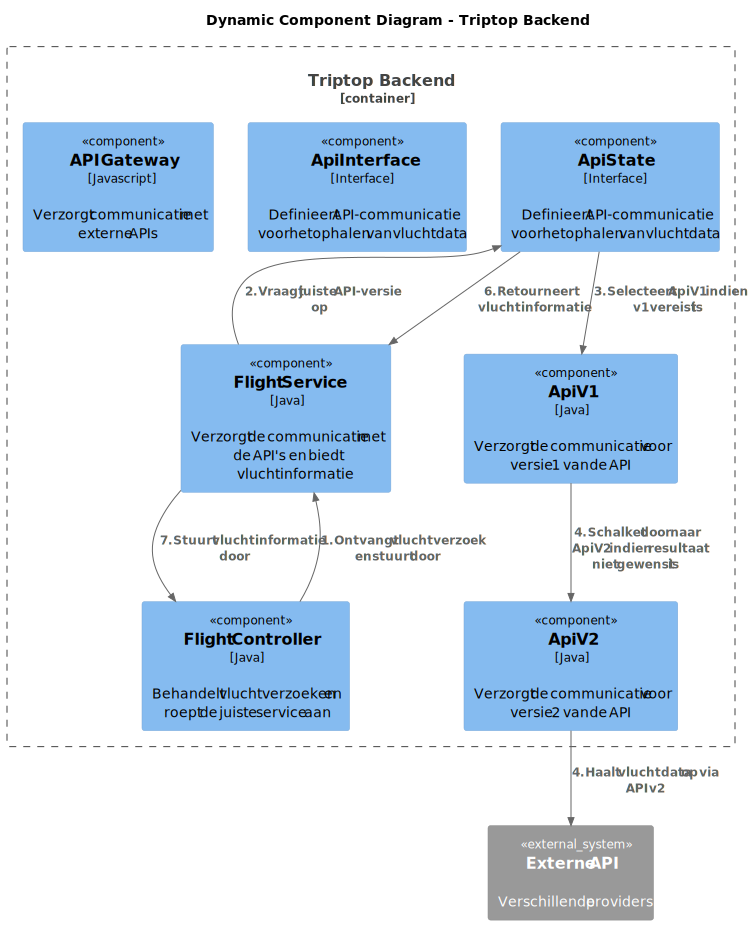
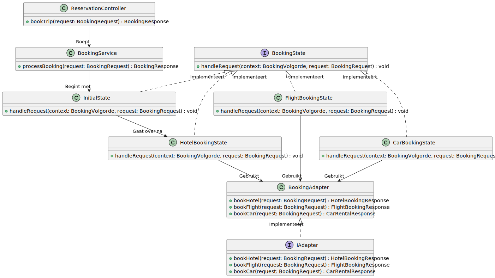

# Software Guidebook Triptop

## 1. Introduction

Dit software guidebook geeft een overzicht van de Triptop-applicatie. Het bevat een samenvatting van het volgende:

1. De vereisten, beperkingen en principes.
1. De software-architectuur, met inbegrip van de technologiekeuzes op hoog niveau en de structuur van de software.
1. De ontwerp- en codebeslissingen die zijn genomen om de software te realiseren.
1. De architectuur van de infrastructuur en hoe de software kan worden geinstalleerd.

## 2. Context

Context diagram van de Triptop applicatie:


Dit diagram toont de omgeving waarin Triptop zich bevindt. Triptop is een online systeem, wat communiceert met verschillende externe systemen.

### Functionaliteit

De Triptop applicatie biedt reizigers de volgende mogelijkheden:

1. Reizigers kunnen zelf hun reis samenstellen door verschillende bouwstenen te combineren.

2. Reizigers kunnen zelf hun reis aanpassen, boeken, betalen en annuleren.

3. Reizigers kunnen hun reisstatus bewaren.

### Gebruikers

Het systeem heeft twee soorten gebruikers, namelijk:

#### Reiziger

De reiziger is de primaire gebruiker van het systeem en heeft toegang tot bovenstaande functionaliteiten. De reiziger kan contact opnemen met de reisagent voor hulp bij vragen of problemen.

#### Reisagent

De reisagent is een medewerker van Triptop die de reiziger ondersteunt bij het plannen en aanpassen van de reis. De reisagent biedt tweedelijns ondersteuning, door bijvoorbeeld vragen te beantwoorden of risico-inschattingen te maken.

We hebben ervoor gekozen om de reisagent niet op te nemen in het context diagram, omdat de reisagent momenteel niet met het systeem communiceert. De reiziger communiceert voor nu telefonisch met de reisagent.

Zodra wij wel iets gaan maken voor de reisagent, gaan we eerst een 'freemium' model bedenken als uitbreiding op de (latere) registratie pagina waarin we 3 tiers hebben:

- TripTop free - Plan en boek je reis geheel gratis, betaal alleen de aanbieders van overnachting (inkomsten via affiliate marketing)
- TripTop NoStress - Raadpleeg al je boekingen en status ook als je offline bent in de middel of nowhere, al je wijzigingen worden geregistreerd en gesynchroniseerd zodra je weer wifi heb. Ook kun je 3 maal tijdens je reis gratis een reisagent raadplegen die expert is in jouw gekozen gebied voor leuke lokale activiteiten
- TripTop Gold - Offline functionaliteit, en daarnaast ook tot 5x per reisdag raadplegen van de reisagent, voor niet alleen leuke activiteiten, maar ook leuke en betaalbare overnachtingsplekken erbij weet, voor alle gaten in je reis.

### Externe systemen

De Triptop applicatie maakt gebruik van verschillende externe systemen. We hebben nog geen keuze gemaakt voor de specifieke API's die we gaan gebruiken voor de verschillende bouwstenen. Hierom hebben we deze onderdelen opgenomen in het diagram als **Provider** van de bijpassende bouwstenen, zoals "Overnachtingprovider" en "Autoverhuurprovider".

Er is gekozen om nog geen betalingsprovider toe te voegen, omdat er gebruik gemaakt zal worden van affiliate marketing. Dit wordt toegelicht in [ADR-001](./adrs/001-betaling_api.md).

## 3. Functional Overview

Om de belangrijkste features toe te lichten zijn er user stories en twee domain stories gemaakt en een overzicht van het domein in de vorm van een domeinmodel. Op deze plek staat typisch een user story map maar die ontbreekt in dit voorbeeld.

### 3.1 User Stories

#### 3.1.1 User Story 1: Reis plannen

Als gebruiker wil ik een zelfstandig op basis van diverse variabelen (bouwstenen) een reis kunnen plannen op basis van mijn reisvoorkeuren (wel/niet duurzaam reizen, budget/prijsklasse, 's nachts reizen of overdag etc.) zodat ik op vakantie kan gaan zonder dat hiervoor een reisbureau benodigd is.

#### 3.1.2 User Story 2: Reis boeken

Als gebruiker wil ik een geplande reis als geheel of per variabele (bouwsteen) boeken en betalen zodat ik op vakantie kan gaan zonder dat hiervoor een reisbureau benodigd is.

#### 3.1.3 User Story 3: Reis cancelen

Als gebruiker wil ik een geboekte reis, of delen daarvan, kunnen annuleren zodat ik mijn geld terug kan krijgen zonder inmenging van een intermediair zoals een reisbureau.

#### 3.1.4 User Story 4: Reisstatus bewaren

Als gebruiker wil ik mijn reisstatus kunnen bewaren zonder dat ik een extra account hoef aan te maken zodat ik mijn reis kan volgen zonder dat ik daarvoor extra handelingen moet verrichten.

#### 3.1.5 User Story 5: Bouwstenen flexibel uitbreiden

Als gebruiker wil ik de bouwstenen van mijn reis flexibel kunnen uitbreiden met een zelf te managen stap (bijv. met providers die niet standaard worden aangeboden zoals een andere reisorganisatie, hotelketen etc.) zodat ik mijn reis helemaal kan aanpassen aan mijn wensen.

### 3.2 Domain Story Reis Boeken (AS IS)


### 3.3 Domain Story Reis Boeken (TO BE)


### 3.4 Domain Model


## 4. Quality Attributes

Voordat deze casusomschrijving tot stand kwam, heeft de opdrachtgever de volgende ISO 25010 kwaliteitsattributen benoemd als belangrijk:

- Compatibility -> Interoperability (Degree to which a system, product or component can exchange information with other products and mutually use the information that has been exchanged)
- Reliability -> Fault Tolerance (Degree to which a system or component operates as intended despite the presence of hardware or software faults)
- Maintainability -> Modularity (Degree to which a system or computer program is composed of discrete components such that a change to one component has minimal impact on other components)
- Maintainability -> Modifiability (Degree to which a product or system can be effectively and efficiently modified without introducing defects or degrading existing product quality)
- Security -> Integrity (Degree to which a system, product or component ensures that the state of its system and data are protected from unauthorized modification or deletion either by malicious action or computer error)
- Security -> Confidentiality (Degree to which a system, product or component ensures that data are accessible only to those authorized to have access)

## 5. Constraints

Een belangrijke beperking binnen dit project is het gebruik van de externe API's via RapidAPI. De API's die in de applicatie worden gebruikt hebben allemaal een limiet op het aantal toegestane verzoeken per dag/week/maand, afhankelijk van het plan. Dit heeft invloed op hoe vaak en op welke manier onze applicatie API-aanvragen kan uitvoeren.

### 5.1.1 API Request Limieten

RapidAPI biedt verschillende abonnementsniveaus aan:

- Basic: Beperkt aantal verzoeken per maand. Geschikt voor kleine testen, maar onbruikbaar voor productie.
- Pro: Hogere limieten en rate limit weg.
- Ultra: Geschikt voor middelgrote bedrijven met frequent gebruik.
- Mega: De hoogste limieten, bedoeld voor grootschalige applicaties met intensief gebruik.

Elk plan heeft hogere kosten en is voor dit project niet te gebruiken. Hierom is er gekozen voor Basic, wat gratis is.

## 6. Principles

### 6.1 Open/Closed Principe

Het Open/Closed principe (OCP) is 1 van de 5 [SOLID-principes](https://www.baeldung.com/solid-principles).
> Definitie: Software entities (zoals classes, modules, functies etc.) moeten open zijn voor extensie, maar gesloten voor modificatie. 

Dit houdt in dat je een bestaande codebase niet aangepast om nieuwe functionaliteit toe te voegen. In plaats daarvan voeg je nieuwe code toe via bijv. abstractie, overerving of interfaces (BigBoxCode, 2025b). 

#### Consequenties van het toepassen van het Open/Closed principe
Voordelen:
- Makkelijk uit te breiden -> Bij het toevoegen van nieuwe functionaliteit kan je bestaande code uitbreiden in plaats van herschrijven.
- Lager risico op bugs -> Door de bestaande code niet te wijzigen, verlaag je de kans dat je per ongeluk de werkende functionaliteit breekt.
- Flexibeler -> Door het gebruik van polymorfisme kan je makkelijk nieuwe implementaties toevoegen.

Nadelen:
- Meer werk in het begin -> Je moet je bij het ontwerpen van code al voorbereiden op hoe je later toevoegingen of aanpassingen wil gaan maken.

#### Het Open/Closed principe wordt gebruikt bij drie ontwerpvragen.

1. Hoe ga je om met aanroepen van externe services die niet beschikbaar zijn en toch verwacht wordt dat er waardevolle output gegeven wordt? **(Burak)**
2. Wat doe je als je vanuit Triptop meerdere externe services, of meerdere aanroepen naar dezelfde service, moet aanroepen en de volgorde van aanroepen van belang is? **(Atakan)**
3. Hoe zorg je ervoor dat je makkelijk een nieuwe externe service kan toevoegen? **(Eva)**

Deze ontwerpvragen gebruiken design patterns waarbij het Open/Closed principe centraal staan, omdat het voor flexibiliteit zorgt.

In de hoofdstukken [7.2.7](#727-component-diagram-meerdere-endpoints-aanroepen-in-dezelfde-api), [7.2.5](#725-component-diagram-aanroepen-van-externe-services-die-niet-beschikbaar-zijn) en [ADR-006](./adrs/006-nieuwe-service.md) is meer informatie te vinden over het Open/Closed principe binnen de context van de applicatie.

### 6.2 Dependency Inversion Principe

Het Dependency Inversion principe (DIP) is ook 1 van de 5 SOLID-principes.
> Definitie: Abstracties moeten niet afhankelijk zijn van details, maar details moeten afhankelijk zijn van abstracties.

Dit houdt in dat hoog-niveau modulen niet direct afhankelijk mogen zijn van laag-niveau modulen, maar beiden van abstracties (interfaces of abstracte klassen). Dit principe zorgt ervoor dat hoog-niveau logica niet afhankelijk is van specifieke implementaties, maar van abstracties. Dit zorgt ervoor dat de code flexibeler en makkelijker uitbreidbaar is. Nieuwe implementaties kunnen worden toegevoegd zonder de code op hoog niveau te wijzigen (BigBoxCode, 2025a).

#### Consequenties van het toepassen van het Dependency Inversion principe
Voordelen:
- Makkelijk uit te breiden -> Nieuwe implementaties kunnen gemakkelijk worden toegevoegd zonder de bestaande logica te breken.
- Flexibeler -> Door het verminderen van afhankelijkheden tussen modulen wordt code flexibeler.

Nadelen:
- Complexer -> Het toevoegen van abstracties kan code complexer maken.

#### Het Dependency Inversion principe wordt gebruikt bij één ontwerpvraag.

1. Hoe zorg je ervoor dat je makkelijk een nieuwe externe service kan toevoegen? **(Eva)**

##### Bronnenlijst
- BigBoxCode. (2025, januari 13). Design Principle: Open/Closed Principle(OCP). BigBoxCode. https://bigboxcode.com/design-principle-open-closed-principle-ocp

- BigBoxCode. (2025b, 13 januari). Design Principle: Dependency Inversion Principle(DIP). BigBoxCode. https://bigboxcode.com/design-principle-dependency-inversion-principle-dip

## 7. Software Architecture

### 7.1. Containers

#### 7.1.1 Statische container diagram van de Triptop applicatie


Dit diagram beschrijft de architectuur van de Triptop applicatie en de interacties tussen de verschillende bouwstenen. De gebruikers van de applicatie zijn de reiziger en de reisagent.

De applicatie is opgebouwd uit verschillende containers. De frontend applicatie, gebouwd met React.js en Vite, is de interface waar de reiziger zijn reis kan samenstellen, boeken, aanpassen, annuleren en betalen. De backend is ontwikkeld met Java en Spring Boot en beheert de logica van de applicatie. De backend ontvangt verzoeken van de frontend en communiceert met de database, waarin alle gegevens over gebruikers en reizen worden opgeslagen. Verder is er een API Gateway, die als poort fungeert tussen de backend en de externe systemen. Deze keuze wordt toegelicht in [ADR-004](./adrs/004-api_gateway.md).

Daarnaast maakt de applicatie gebruik van verschillende externe systemen via de API Gateway. De Booking COM API biedt informatie over accommodaties, vluchten, autohuur en attracties. De Uber Eats API toont restaurants. Via de WireMock API wordt de identiteit van de reiziger geverifieerd door middel van Single Sign-On (SSO). Tot slot biedt de Maps Data API informatie over locaties. Voor het prototype wordt gebruik gemaakt van de Maps Data API. De Google Maps API, die daadwerkelijk routes en kaarten levert, werkt met een betaald model en is niet geschikt voor ontwikkeling zonder kosten.

In het containerdiagram is het aantal externe providers lager ten opzichte van het contextdiagram. Dit komt doordat de Booking COM API als primaire provider wordt gebruikt voor meerdere bouwstenen. Deze keuze is gemaakt om het aantal integraties te verlagen en wordt toegelicht in [ADR-002](./adrs/002-booking_api.md).

De frontend applicatie communiceert met de backend, die de benodigde gegevens uit de database haalt en de externe systemen via de API Gateway aanroept om aanvullende informatie op te halen of handelingen uit te voeren, zoals het boeken van tickets of het verifiëren van de identiteit van de reiziger.

#### 7.1.2 Dynamisch container diagram voor Inloggen scenario


Dit diagram beschrijft de dynamische architectuur van de Triptop applicatie bij het inloggen van de reiziger. De reiziger start de authenticatie door zijn inloggegevens in te voeren op de frontend van de applicatie. De frontend stuurt vervolgens een authenticatieverzoek naar de WireMock API. Als de verificatie succesvol is, ontvangt de frontend een token van de WireMock API.

Met deze token stuurt de frontend een validatieverzoek naar de backend. De backend controleert de token en haalt de bijbehorende gegevens op uit de database. Na het ophalen van de gegevens stuurt de backend het resultaat van de inlogpoging terug naar de frontend. Als alles correct is verlopen, wordt de reiziger ingelogd en krijgt hij/zij toegang tot de applicatie.

Dit diagram toont alleen de happy path. Edge cases zijn momenteel nog niet in de scope en worden later behandeld.

#### 7.1.3 Dynamisch container diagram voor Reis boeken scenario


Dit diagram beschrijft de dynamische architectuur van de Triptop applicatie wanneer een reiziger een reis plant en boekt. De reiziger begint door een reis samen te stellen via de frontend van de applicatie. De frontend stuurt de ingevulde reisgegevens door naar de backend.

De backend verwerkt deze gegevens en slaat de boeking op in de database. Zodra de data opgeslagen is, stuurt de backend een bevestiging hiervan naar de frontend. De frontend toont vervolgens de bevestiging aan de reiziger, die hiermee geïnformeerd wordt dat zijn/haar reis succesvol is geboekt.

Dit diagram toont alleen de happy path. Edge cases zijn momenteel nog niet in de scope en worden later behandeld.

### 7.2. Components

#### 7.2.1 Component diagram integriteit externe API's


Dit componentendiagram toont de structuur van de Triptop backend en hoe de verschillende onderdelen samenwerken om API-communicatie betrouwbaar te verwerken.

Binnen het systeem is de ApiState gedefinieerd als de interface die de communicatie tussen de verschillende API-versies en de Flight Service regelt, en het mogelijk maakt om dynamisch over te schakelen tussen verschillende versies van de API.
ApiV1 en ApiV2 vertegenwoordigen de verschillende versies van de API en implementeren de ApiState interface. Beide versies verzorgen de communicatie met externe vluchtdata-API's via HTTPS en JSON. Ze zijn verantwoordelijk voor het ophalen van vluchtdata van de externe API, die wordt geleverd door verschillende providers.
De Flight Service verzorgt de communicatie met de ApiV1 en ApiV2 componenten, afhankelijk van de versie die wordt gebruikt, en zorgt ervoor dat de gevraagde vluchtinformatie wordt opgehaald.

Tijdens het uitprogrammeren van het prototype ontstond er een misverstand. Het werd later pas duidelijk dat de ApiInterface eigenlijk dezelfde functionaliteit heeft als de ApiState en dat het eigenlijk maar één bestand hoefte te zijn. Toch is er besloten om de ApiInterface te houden aangezien deze al was geïmplementeerd en het tijd zou kosten om het er uit te halen.

In de tekening is ook de API Gateway te zien. We hebben gekozen om deze niet meer te gebruiken, maar nog wel te tonen in onze diagrammen.
De beslissing voor het niet gebruiken van de API Gateway wordt benoemt in [ADR-004](./adrs/004-api_gateway.md).

#### 7.2.2 Dynamic diagram integriteit externe API's



Dit dynamische componentendiagram laat zien hoe API-verzoeken door de Triptop backend worden verwerkt en welke stappen daarbij worden doorlopen.

De Flight Controller ontvangt een vluchtverzoek van de client en stuurt dit door naar de Flight Service voor verdere verwerking.
De Flight Service vraagt via de ApiState-interface welke API-versie geschikt is voor het ophalen van de vluchtdata.
De ApiState-component bepaalt op basis van het verzoek of ApiV1 moet worden gebruikt en schakelt deze in als versie 1 van de API de benodigde informatie kan leveren.
Indien ApiV1 geen bevredigend resultaat oplevert, wordt het verzoek doorgestuurd naar ApiV2 voor een alternatieve verwerking.
ApiV2 maakt vervolgens verbinding met een externe API om de meest actuele vluchtinformatie op te halen.
Nadat de juiste gegevens zijn opgehaald, stuurt de ApiState-component de vluchtinformatie terug naar de Flight Service en die stuurt de informatie door naar de Flight Controller.

Tijdens het uitprogrammeren van het prototype ontstond er een misverstand. Het werd later pas duidelijk dat de ApiInterface eigenlijk dezelfde functionaliteit heeft als de ApiState en dat het eigenlijk maar één bestand hoefte te zijn. Toch is er besloten om de ApiInterface te houden aangezien deze al was geïmplementeerd en het tijd zou kosten om het er uit te halen.

In de tekening is ook de API Gateway te zien. We hebben gekozen om deze niet meer te gebruiken, maar nog wel te tonen in onze diagrammen.
De beslissing voor het niet gebruiken van de API Gateway wordt benoemt in [ADR-004](./adrs/004-api_gateway.md).

#### 7.2.3 Component diagram toevoegen van een nieuwe externe service


Dit diagram geeft de componenten uit de back-end weer die betrokken zijn bij het ophalen van restaurantdata via de externe service. De structuur is ingericht volgens de [hexagonale architectuur](./adrs/006-nieuwe-service.md). De `RestaurantService` communiceert niet direct met de API-implementatieklasse, maar maakt gebruik van een port-interface (RestaurantPort) die wordt geïmplementeerd door een adapterklasse (UberEatsScraperAdapter).

De adapter is verantwoordelijk voor de communicatie met de externe Uber Eats Scraper API en zet de ontvangen data om naar de structuur van het domeinmodel. Binnen de adapter wordt het Template Method Pattern toegepast om de aanroep van de externe API te structureren. Dit houdt in dat de abstracte klasse, `APICaller`, de vaste stappen van de API-aanroep definieert. Deze structuur wordt verder toegelicht in de paragraaf [Class diagram toevoegen van een nieuwe externe service](#732-class-diagram-toevoegen-van-een-nieuwe-externe-service).

Bovenstaand diagram is beperkt tot de aanroep van restaurantdata. Andere bouwstenen (zoals hotels of autoverhuur) volgen dezelfde structuur, maar zijn niet in dit diagram meegenomen. Om dit te verduidelijken hebben we een diagram gemaakt waar, als voorbeeld, een tweede externe restaurantservice (Tripadvisor) is toegevoegd en een externe hotelservice (Booking COM). Dit diagram is opgenomen in [Bijlage A - Voorbeeld toevoegen van een externe service en stappenplan](./bijlageA.md), samen met een concreet stappenplan hoe je een nieuwe feature toevoegd.

#### 7.2.4 Dynamic diagram toevoegen van een nieuwe externe service


Dit diagram laat zien hoe de componenten samenwerken tijdens een runtime-scenario waarin de gebruiker restaurants opvraagt via de front-end. De service roept via de port de adapter aan, die vervolgens met de externe API communiceert. De interactie tussen de componenten is gebaseerd op de Ports en Adapters structuur en maakt gebruik van het Template Method Pattern om de stappen binnen de API-aanroep (zoals authenticatie en dataverwerking) te structureren. 

Dit diagram is beperkt tot de aanroep van restaurantdata. Andere bouwstenen (zoals hotels of autoverhuur) volgen dezelfde structuur, maar zijn niet in dit diagram meegenomen.

#### 7.2.5 Component diagram aanroepen van externe services die niet beschikbaar zijn


Dit component diagram toont de architectuur van het **Triptop** systeem, met name die van de backend. De **Triptop Applicatie** stuurt verzoeken naar de backend, die bestaat uit meerdere componenten zoals de **EatsController**, **EatsService**, **EatsAdapter** en **EatsRepository**. De backend verwerkt API-aanvragen, beheert data en communiceert met externe systemen zoals de **UberEats API** en een **Redis Cache** voor tijdelijke opslag van restaurantgegevens.

##### Welke keuzes zijn er gemaakt?

Tijdens het ontwerpen van mijn prototype, kwam ik erachter dat er meerdere manieren waren om mijn onderzoeksvraag te beantwoorden. Hierdoor twijfelde ik tussen een alternatieve API of de Redis Cache. Uiteindelijk heb ik voor de redis cache gekozen. Mijn redenering is te vinden in [ADR-7](./adrs/007-api_or_cache.md).

Voor mijn ontwerp heb ik gekozen voor het **Strategy Pattern**. Dit patroon maakt het mogelijk om flexibel te schakelen tussen verschillende strategieën als de UberEats API tijdelijk niet beschikbaar is. Bijvoorbeeld, in plaats van een foutmelding te geven, kan de applicatie overschakelen op een caching-strategie met Redis. Het Strategy Pattern heb ik geintegreerd in het [code diagram](#733-class-diagram-aanroepen-van-externe-services-die-niet-beschikbaar-zijn).

Voor het meest passende principe koos ik voor het **Open/Closed Principle (OCP)**. Dit principe stelt dat softwarecomponenten open moeten zijn voor uitbreiding, maar gesloten voor modificatie. Dit sluit goed aan bij het Strategy Pattern, omdat nieuwe strategieën kunnen worden toegevoegd zonder bestaande code te wijzigen. Hierdoor blijft de architectuur flexibel en onderhoudbaar. Informatie over het Open/Closed principe is te vinden in [de principes hoofdstuk](#61-openclosed-principe) en de code implementatie is te zien in mijn [code diagram](#733-class-diagram-aanroepen-van-externe-services-die-niet-beschikbaar-zijn).

#### 7.2.6 Dynamic diagram aanroepen van externe services die niet beschikbaar zijn


Dit diagram laat stap voor stap zien hoe de Triptap Applicatie omgaat met een aanvraag voor restaurantgegevens. Het geeft een dynamisch beeld van hoe de verschillende onderdelen samenwerken om de juiste data op te halen.
Hoe werkt het?

1. De gebruiker vraagt gegevens op via de Triptap Applicatie (bijvoorbeeld een lijst met restaurants).

2. EatsController ontvangt de aanvraag en stuurt deze door naar EatsService.

3. EatsService controleert eerst of de gegevens al in de cache (EatsRepository / Redis Cache) staan.

4. Als de gegevens in de cache staan, worden ze direct teruggestuurd.

5. Als de gegevens niet in de cache staan, haalt EatsAdapter ze op bij de UberEats API.

6. De opgehaalde gegevens worden opgeslagen in de cache, zodat ze later sneller beschikbaar zijn.

7. De restaurantgegevens worden teruggestuurd naar de gebruiker.

#### 7.2.7 Component diagram meerdere endpoints aanroepen in dezelfde API


##### Werking van diagram

Containers en externe systemen:

- TripTop (Hoofdapplicatie): De frontend applicatie geschreven in React die communiceert met de backend via API-aanroepen.

- Database (NoSQL Redis): De opslag van gegevens.

- Booking COM API: Een extern systeem dat informatie geeft over hotels, vluchten, en autoverhuur.

Componenten in de backend:

- Reservatie Controller: Ontvangt de boekingsverzoeken van de gebruiker en verstuurt ze naar de Booking Service.

- Booking Service: Verwerkt de boekingsaanvragen en schakelt tussen de verschillende Booking States.

- Booking States: Bestaat uit de verschillende states van het boekingsproces, zoals hotel, vlucht, autoboekingen en begin state.

- Booking Adapter: Verzorgt de communicatie met de externe Booking.com API voor het ophalen van boekingsdata.

- Trip Repository: Slaat de boekingsgegevens op in de database.

##### Extra toelichting

Het component diagram maakt gebruik van een state pattern. Dit is in het diagram te zien in de vorm van de Booking States component. Er werd hiervoor gekozen, omdat de koppeling tussen de vier gebruikte states hoog is (voor meer uitleg, bekijk [ADR-008](./adrs/008-pattern-keuze.md)).
De details van de states worden uitgelicht in het [klassediagram](#734-class-diagram-meerdere-endpoints-aanroepen-in-dezelfde-api). Voor het design principe is er gekozen voor een open/closed design. Dit staat nauw in verband met de states, die niet worden veranderd, maar wel uitgebreid kunnen worden.
Het diagram laat ook een repository en database zien. Dit is meegenomen in het diagram om het verband tussen de componenten te kunnen laten zien, maar vallen wel buiten de scope van de ontwerpvraag.
Hierdoor is ervoor gekozen bij nader inzien en overleg met een docent om dit buitenwege te laten bij de gemaakte prototype.

#### 7.2.8 Dynamic diagram meerdere endpoints aanroepen in dezelfde API


##### Werking van diagram

De volgorde in het diagram staat hier kort beschreven:

1. TripTop maakt een boekingsverzoek aan via een API-aanroep naar de Reservatie Controller.

2. De Reservatie Controller verstuurt de boekingsaanvraag naar de Booking Service.

3. De Booking Service schakelt naar de Booking States.

4. De Booking States gebruiken de Booking Adapter om gegevens op te halen van de Booking.com API (zoals beschikbaarheid en prijzen).

5. Na het ontvangen van de gegevens, stuurt de Booking States de resultaten terug naar de Booking Service.

6. De Booking Service slaat de boekingsgegevens op in de Trip Repository en bevestigt de gegevens naar de Reservatie Controller.

7. Ten slotte stuurt de Reservatie Controller de bevestiging terug naar de gebruiker via TripTop.

##### Extra toelichting

In totaal zijn er elf stappen beschreven. Er is alhoewel twee plekken in het diagram wat meer uitleg vraagt.
Bij stap vijf gaat er één pijl naar de api, maar geen pijl terug. Dit is zo gedaan, omdat de pijl de context beschrijft op een manier dat laat zien dat er een reactie is.
De adapter vraagt de beschikbaarheid op bij de api, nu wordt er al verteld wat er terug komt en is het niet noodzakelijk om het nog een keer te benoemen.
Hetzelfde gelt voor stap negen uiteraard.

### 7.3. Design & Code

#### 7.3.1. Class diagram integriteit externe API's


Het klassendiagram toont de structuur van het systeem voor het ophalen van vluchtgegevens via verschillende API-versies. De architectuur is gebaseerd op het State Pattern, wat zorgt voor een flexibele overgang tussen API-versies zonder dat de service expliciet verantwoordelijk is voor het wisselen van strategieën.

De ApiState-interface is de basis voor de API-states en bevat methoden om vluchtgegevens op te halen en over te schakelen naar een volgende staat. Deze interface wordt geïmplementeerd door ApiV1 en ApiV2, die elk hun eigen versie van getFlights() bevatten. De API's houden daarnaast een referentie bij naar een volgende API-state, zodat de overgang naar een nieuwere API-versie eenvoudig kan worden beheerd.

Tijdens het uitprogrammeren van het prototype ontstond er een misverstand. Het werd later pas duidelijk dat de ApiInterface eigenlijk dezelfde functionaliteit heeft als de ApiState en dat het eigenlijk maar één bestand hoefte te zijn. Toch is er besloten om de ApiInterface te houden aangezien deze al was geïmplementeerd en het tijd zou kosten om het er uit te halen.

#### Sequence diagram integriteit externe API's


Het sequence diagram beschrijft de dynamische interactie tussen verschillende componenten van de Triptop Backend bij het ophalen van vluchtinformatie.

De Triptop Backend verwerkt een GET-aanvraag van de client om vluchtinformatie op te halen. De Flight Controller stuurt deze door naar de Flight Service, die via ApiState standaard ApiV1 gebruikt.

ApiV1 vraagt gegevens op bij een externe API. Als de respons correct is, worden de gegevens teruggestuurd naar de client. Als de gegevens onjuist of onvolledig zijn, wordt overgeschakeld naar ApiV2 via setNextState(ApiV2). ApiV2 haalt vervolgens opnieuw vluchtinformatie op en retourneert deze.

De Flight Service ontvangt de vluchtinformatie van ApiV1 of ApiV2 en stuurt deze terug naar de Flight Controller, die een HTTP 200 OK-respons naar de client verstuurt.

#### 7.3.2. Class diagram toevoegen van een nieuwe externe service


Dit klassendiagram geeft de klassen weer die betrokken zijn bij het ophalen van restaurantdata via de externe service.

Om binnen de adapters consistentie te behouden in de manier waarop externe API’s worden aangeroepen, passen we het Template Method Pattern toe. De abstracte klasse `APICaller` definieert de structuur van een API-aanroep via `executeAPICall()`. Deze methode bepaalt de vaste volgorde van stappen, namelijk het controleren van de token, eventueel inloggen en de daadwerkelijke API-aanroep.

In `checkToken()` wordt gecontroleerd of er een geldige access token beschikbaar is. Zo niet, dan wordt `login()` uitgevoerd. In `login()` wordt de access token opgehaald bij de officiële API. Omdat we in het prototype werken met mockAPI’s via RapidAPI (waar geen token vereist is), wordt in `checkToken()` de token op 'null' gezet. `login()` print een String dat er is ingelogd, maar bevat nog geen inloglogica. Het was de bedoeling om de API key en URL op te halen uit application.properties in de loginmethode, zodat het nut van het Template Method Pattern gedemonstreerd kon worden. Echter lukte dit niet, dus wordt dit via de constructor van de adapters gedaan.

`callAPI()` voert de daadwerkelijke API aanroep uit. De adapterklassen zelf verzorgen de concrete invulling van deze methode per aanbieder.

Dit zorgt voor een herbruikbare en consistente aanroepstructuur, terwijl de specifieke implementatie voor iedere aanbieder flexibel blijft. Dit is van belang in de constructiefase, wanneer we met de officiële API's gaan werken. De Template Method Pattern garandeert dat er eerst wordt ingelogd, mits er niet al een geldige token bestaat, en pas daarna een API aanroep gedaan wordt.

> De Location class uit het domeinmodel is weggelaten i.v.m. leesbaarheid van het diagram. Als vervanging hiervoor is een `String address` opgenomen.

> De methode `executeAPICall()` is twee keer opgenomen in dit diagram, één keer met en één keer zonder parameters. De parameters die de methode getRestaurants(query, address) krijgt worden omgezet tot een Map genaamd 'parameters', zodat ze uniform kunnen worden doorgegeven aan de callAPI() methode. 

Voor meer informatie over het Template Method Pattern, zie de volgende bron:

- Het artikel [Template Method Design Pattern in Java](https://www.geeksforgeeks.org/template-method-design-pattern-in-java/) van Geeks for Geeks geeft een praktische uitleg van het pattern in Java.

##### Sequence Diagram toevoegen van een nieuwe externe service


Bovenstaand diagram geeft de stappen weer om restaurantdata op te halen. Het diagram geeft alleen de happy path weer. Er zijn dus geen edge cases meegenomen, zoals het mislukken van de API aanroep. Als de API aanroep mislukt, wordt er een foutmelding teruggegeven aan de reiziger. De stappen zijn als volgt:

1. De reiziger stuurt een POST request naar de `RestaurantController` met een `RestaurantDTO` (een query en een address);
2. `RestaurantController` roept `RestaurantService` aan met `getRestaurants(query, address)`;
3. `RestaurantService` roept `UberEatsScraperAdapter` aan met `getRestaurants(query, address)` om de API-aanroep te doen;
4. `UberEatsScraperAdapter` voert de API-aanroep uit via `executeAPICall(parameters)`. Als er geen geldige token beschikbaar is, wordt de loginmethode uitgevoerd. In het prototype is hier nog geen logica voor geïmplementeerd;
5. `callAPI(parameters)` stuurt een POST request naar de Uber Eats Scraper API en krijgt een response met data terug;
6. De response data wordt omgezet naar een List met Restaurant-objecten en als returnwaarde van de getRestaurants methode teruggegeven aan de reiziger.

#### 7.3.3. Class diagram aanroepen van externe services die niet beschikbaar zijn


Dit diagram laat zien hoe de verschillende onderdelen van het **Triptop backend-systeem** met elkaar samenwerken. Het belangrijkste doel van dit systeem is om restaurantgegevens op te halen, zelfs als de externe UberEats API niet beschikbaar is.

##### Wat gebeurt er in het systeem?

- **EatsController**: Ontvangt aanvragen en stuurt ze door naar **EatsService**.
- **EatsService**: Kiest de beste manier om restaurantgegevens op te halen. Als de API niet werkt, gebruikt het een andere methode.
- **RetrieveDataStrategy**: Dit is een soort "plan" dat bepaalt hoe gegevens worden opgehaald. Er zijn twee strategieën:
  - **RetrieveFromAPIStrategy**: Probeert gegevens op te halen via de UberEats API.
  - **RetrieveFromCacheStrategy**: Haalt gegevens op uit de **cache** (tijdelijke opslag), zodat het systeem blijft werken als de API offline is.
- **EatsFallbackException**: Wordt gebruikt als er helemaal geen gegevens beschikbaar zijn.

##### Hoe implementeer je een nieuwe strategie?

Je kan een nieuwe strategie implementeren door het volgende te doen:

1. Je maakt een nieuwe klasse in de `strategy` package. Laten we als voorbeeld `RetrieveFromAlternativeStrategy` maken.
2. Annoteer deze klasse met `@Component` annotatie en implementeer de `RetrieveDataStrategy` interface.
3. Neem de methode `retrieveData` op en codeer hoe de methode moet werken.

Dit voldoet aan de Open/Closed principe, omdat je niks aan de "parent" klasse moet wijzigen om je nieuwe klasse werkend te krijgen en omdat je niks hoeft aan te passen aan de oude code om de nieuwe strategie te laten werken.

##### Sequence Diagram - aanroepen van externe services die niet beschikbaar zijn


Dit diagram toont aan hoe de klasses in mijn applicatie samenwerken om de reiziger een bruikbare response te geven na het doen van een request. Het gaat als volgt:

###### **Happy Path**

1. **De gebruiker stuurt een POST-request** naar `/restaurants` met een `query` (zoekterm) en een `address` (locatie).
2. **De request wordt verwerkt door de controller** (`EatsController`), die de service (`EatsServiceImpl`) aanroept om de gegevens op te halen.
3. **De service probeert data op te halen via een strategie** (`RetrieveDataStrategy`), die eerst de **API-strategie** (`RetrieveFromAPIStrategy`) gebruikt.
4. **De API-strategie roept een externe API aan** via `EatsAdapterImpl`, die een verzoek stuurt naar de **Uber Eats API**.
5. **De API reageert met JSON-data**, die vervolgens wordt verwerkt en **opgeslagen in de repository** (`EatsRepository`), zodat het later gecached kan worden.
6. **De data wordt teruggestuurd naar de gebruiker**, met een indicatie dat deze **niet uit de cache komt** (`cached=false`).

###### **Edge Case: API is niet beschikbaar**

Als de Uber Eats API niet beschikbaar is, wordt door middel van het **Strategy Pattern** overgestapt naar de **Cache Strategy**. Dit gaat als volgt:

1. **Er wordt een `APIStrategyFailureException` gegooid.**
2. **De applicatie probeert vervolgens de cache-strategie** (`RetrieveFromCacheStrategy`).
3. **De cache-strategie zoekt in de database** (`EatsRepository`).
4. **Als er restaurants worden gevonden, worden deze aan de gebruiker teruggegeven met `cached=true`.**

#### 7.3.4 Class diagram meerdere endpoints aanroepen in dezelfde API



##### Werking van diagram

DEe architectuur van het boekingssysteem en de interacties tussen de verschillende klassen en interfaces:

- ReservationController: Dit is de controller die de boekingsaanvraag van de reiziger ontvangt. Het heeft een methode bookTrip die een BookingRequest ontvangt en een BookingResponse retourneert.

- BookingService: Deze service verwerkt de boeking door de verschillende boeking states te activeren. Het roept de processBooking-methode aan om de boeking te verwerken.

- BookingState (interface): Deze interface definieert de methode handleRequest die wordt geïmplementeerd door de verschillende states. 

- InitialState, HotelBookingState, FlightBookingState, CarBookingState: Deze klassen implementeren de BookingState interface en behandelen de specifieke fasen van de boeking (beginfase, hotel, vlucht en auto).

- BookingAdapter: Dit is de adapter die de communicatie verzorgt met externe systemen, zoals de Booking.com API, om de gegevens voor hotel-, vlucht- en autoboekingen op te halen. Het implementeert de IAdapter interface.

- IAdapter (interface): Deze interface definieert de methoden die door de adapter worden geïmplementeerd om hotels, vluchten en auto's te boeken en de bijbehorende gegevens op te halen.

##### Extra toelichting

Het klasse diagram zoals te zien op het plaatje verantwoord niet elke klasse aanwezig in het prototype. Dit komt doordat vele klasse niet essentieel zijn om op te nemen in het diagram, als dit wel werd gedaan zou het voor meer onduidelijkheid zorgen.
Dit geldt voor de volgende klasse. De domein klasse, de exception klassen en de adapter wrapper zijn buiten gesloten. De domein en exception klasse gelden voor zichzelf, maar de adapter wrapper in inprincipe een tussen klasse voor de states en de adapter.
Dit is zo gedaan om de cohesie te vergroten. Daarnaast is er in het diagram te zien dat initialstate over gaat naar de hotelbookingstate, maar deze state niet naar de andere. Dit is zo gedaan om geen verwarring op te wekken, aangezien ze in werkelijkheid elkaar niet aanroepen, maar switchen van state.
De switchen van states wordt gedaan door de aanroep van een methode en de code in de service. Voor verduidelijking kijk naar sequencediagram meerdere endpoints aanroepen in dezelfde API.

##### Sequence diagram meerdere endpoints aanroepen in dezelfde API


Het sequence diagram laat de volgorde zien van de verschillende klassen en states. Dit gaat als volgt

###### **Happy Path**

1. **De Reiziger stuurt een boekingsaanvraag naar de ReservationController met de details van de reis en de ReservationController stuurt de aanvraag door naar de BookingService.**
2. **De BookingService ontvangt de aanvraag en roept de InitialState aan om de boeking te verwerken.**
3. **De InitialState roept als eerst HotelBookingState aan die vervolgens met de adapter communiceert. De HotelBookingState krijgt een response terug en switcht van state. Dit gebeurt nog is twee keer van vlucht naar auto en dan terug naar de InitialState.**
4. **Elke state returnt zijn response naar de BookingService en de service returnt de response terug naar de controller en uiteindelijk naar de reiziger.**

Er zijn geen edge cases meegenomen in het diagram, aangezien deze buiten de scope van de ontwerpvraag vallen.

## 8. Architectural Decision Records

### ADR 1 - [Betaling API](./adrs/001-betaling_api.md)

### ADR 2 - [Booking API](./adrs/002-booking_api.md)

### ADR 3 - [API Development Tool](./adrs/003-api_development_tool.md)

### ADR 4 - [API Gateway](./adrs/004-api_gateway.md)

### ADR 5 - [Integriteit API](./adrs/005-integriteit-api.md)

### ADR 6 - [Nieuwe Service](./adrs/006-nieuwe-service.md)

### ADR 7 - [API of Redis Cache](./adrs/007-api_or_cache.md)

### ADR 8 - [Pattern Keuze](./adrs/008-pattern-keuze.md)

## 9. Deployment, Operation and Support

Om de software te installeren en te kunnen draaien, volg je de onderstaande stappen:

### Wat heb je nodig?

De volgende software heb je nodig om de Triptop Applicatie te kunnen draaien:

- **Redis:** Redis kan je installeren door [deze tutorial](https://redis.io/docs/latest/operate/oss_and_stack/install/install-redis/) van de officiele redis website te volgen.
- **Java:** De programmeertaal waarin de Triptop Applicatie gemaakt is.
- **Maven:** Nodig voor het programma en de libraries die gebruikt zijn.
- **IntelliJ Idea:** Om het programma op te starten en verder uit te breiden.

### Installatie stappen

#### Clone de repository

Begin met het clonen van de projectrepository naar je lokale machine. Dit kan onder andere met het volgende command:

```bash
git clone https://github.com/AIM-ENE-feb25/triptop-beca.git
```

#### Start redis

Start redis door het volgende commando in te voeren:

```
sudo service redis-server start
```

Om te checken of je redis server werkt, kan je in de cli gaan door `redis-cli` in je command line in te voeren. Je resultaat hoort er als volgt uit te zien:

```
127.0.0.1:6379> ping
PONG
```

#### Installeer dependencies

Navigeer naar de projectdirectory en voer het volgende commando uit om de dependencies te installeren:

```bash
mvn install
```

#### Start de applicatie

Start de applicatie op door in IntelliJ op de startknop rechtsboven te drukken.

#### Test de API endpoints met Postman

Gebruik Postman om de verschillende endpoints van de applicatie te testen. Bijvoorbeeld, je kunt de GET /flights endpoint testen door de juiste parameters zoals from, to, en date mee te geven:

```http request
http://localhost:8080/flights?from=EIN&to=BCN&date=2025-05-03
```
