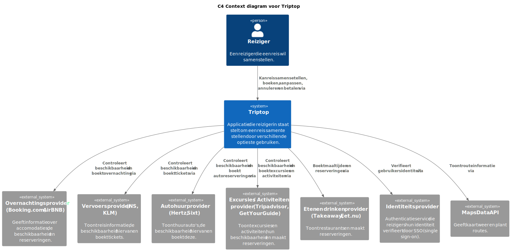

# Software Guidebook Triptop

## 1. Introduction

Dit software guidebook geeft een overzicht van de Triptop-applicatie. Het bevat een samenvatting van het volgende:

1. De vereisten, beperkingen en principes.
1. De software-architectuur, met inbegrip van de technologiekeuzes op hoog niveau en de structuur van de software.
1. De ontwerp- en codebeslissingen die zijn genomen om de software te realiseren.
1. De architectuur van de infrastructuur en hoe de software kan worden geinstalleerd.

## 2. Context

Context diagram van de Triptop applicatie:

Dit diagram toont de omgeving waarin Triptop zich bevindt. Triptop is een online systeem, wat communiceert met verschillende externe systemen.

### Functionaliteit

De Triptop applicatie biedt reizigers de volgende mogelijkheden:

1. Reizigers kunnen zelf hun reis samenstellen door verschillende bouwstenen te combineren.

2. Reizigers kunnen zelf hun reis aanpassen, boeken, betalen en annuleren.

3. Reizigers kunnen hun reisstatus bewaren.

### Gebruikers

Het systeem heeft twee soorten gebruikers, namelijk:

#### Reiziger

De reiziger is de primaire gebruiker van het systeem en heeft toegang tot bovenstaande functionaliteiten. De reiziger kan contact opnemen met de reisagent voor hulp bij vragen of problemen.

#### Reisagent

De reisagent is een medewerker van Triptop die de reiziger ondersteunt bij het plannen en aanpassen van de reis. De reisagent biedt tweedelijns ondersteuning, door bijvoorbeeld vragen te beantwoorden of risico-inschattingen te maken.

We hebben ervoor gekozen om de reisagent niet op te nemen in het context diagram, omdat de reisagent momenteel niet met het systeem communiceert. De reiziger communiceert voor nu telefonisch met de reisagent.

### Externe systemen

De Triptop applicatie maakt gebruik van verschillende externe systemen. We hebben nog geen keuze gemaakt voor de specifieke API's die we gaan gebruiken voor de verschillende bouwstenen. Hierom hebben we deze onderdelen opgenomen in het diagram als **Provider** van de bijpassende bouwstenen, zoals "Overnachtingprovider" en "Autoverhuurprovider".

Er is gekozen om nog geen betalingsprovider toe te voegen, omdat er gebruik gemaakt zal worden van affiliate marketing. Dit wordt toegelicht in [ADR-001](./adrs/001-betaling_api.md).

## 3. Functional Overview

Om de belangrijkste features toe te lichten zijn er user stories en twee domain stories gemaakt en een overzicht van het domein in de vorm van een domeinmodel. Op deze plek staat typisch een user story map maar die ontbreekt in dit voorbeeld.

### 3.1 User Stories

#### 3.1.1 User Story 1: Reis plannen

Als gebruiker wil ik een zelfstandig op basis van diverse variabelen (bouwstenen) een reis kunnen plannen op basis van mijn reisvoorkeuren (wel/niet duurzaam reizen, budget/prijsklasse, 's nachts reizen of overdag etc.) zodat ik op vakantie kan gaan zonder dat hiervoor een reisbureau benodigd is.

#### 3.1.2 User Story 2: Reis boeken

Als gebruiker wil ik een geplande reis als geheel of per variabele (bouwsteen) boeken en betalen zodat ik op vakantie kan gaan zonder dat hiervoor een reisbureau benodigd is.

#### 3.1.3 User Story 3: Reis cancelen

Als gebruiker wil ik een geboekte reis, of delen daarvan, kunnen annuleren zodat ik mijn geld terug kan krijgen zonder inmenging van een intermediair zoals een reisbureau.

#### 3.1.4 User Story 4: Reisstatus bewaren

Als gebruiker wil ik mijn reisstatus kunnen bewaren zonder dat ik een extra account hoef aan te maken zodat ik mijn reis kan volgen zonder dat ik daarvoor extra handelingen moet verrichten.

#### 3.1.5 User Story 5: Bouwstenen flexibel uitbreiden

Als gebruiker wil ik de bouwstenen van mijn reis flexibel kunnen uitbreiden met een zelf te managen stap (bijv. met providers die niet standaard worden aangeboden zoals een andere reisorganisatie, hotelketen etc.) zodat ik mijn reis helemaal kan aanpassen aan mijn wensen.

### 3.2 Domain Story Reis Boeken (AS IS)

### 3.3 Domain Story Reis Boeken (TO BE)

### 3.4 Domain Model

## 4. Quality Attributes

Voordat deze casusomschrijving tot stand kwam, heeft de opdrachtgever de volgende ISO 25010 kwaliteitsattributen benoemd als belangrijk:

- Compatibility -> Interoperability (Degree to which a system, product or component can exchange information with other products and mutually use the information that has been exchanged)
- Reliability -> Fault Tolerance (Degree to which a system or component operates as intended despite the presence of hardware or software faults)
- Maintainability -> Modularity (Degree to which a system or computer program is composed of discrete components such that a change to one component has minimal impact on other components)
- Maintainability -> Modifiability (Degree to which a product or system can be effectively and efficiently modified without introducing defects or degrading existing product quality)
- Security -> Integrity (Degree to which a system, product or component ensures that the state of its system and data are protected from unauthorized modification or deletion either by malicious action or computer error)
- Security -> Confidentiality (Degree to which a system, product or component ensures that data are accessible only to those authorized to have access)

## 5. Constraints

Een belangrijke beperking binnen dit project is het gebruik van de externe API's via RapidAPI. De API's die in het applicatie worden gebruikt hebben allemaal een limiet op het aantal toegestane verzoeken per dag/week/maand, afhankelijk van het plan. Dit heeft invloed op hoe vaak en op welke manier onze applicatie API-aanvragen kan uitvoeren.

### 5.1.1 API Request Limieten

RapidAPI biedt verschillende abonnementsniveaus aan:

- Basic: Beperkt aantal verzoeken per maand. Geschikt voor kleine testen, maar onbruikbaar voor productie.
- Pro: Hogere limieten en rate limit weg.
- Ultra: Geschikt voor middelgrote bedrijven met frequent gebruik.
- Mega: De hoogste limieten, bedoeld voor grootschalige applicaties met intensief gebruik.

Elk plan heeft hogere kosten en is voor dit project niet te gebruiken, daarom is er gekozen voor Basic wat gratis is.

## 6. Principles

### 6.1 Open/Closed principe

Het Open/Closed principe wordt gebruikt bij twee ontwerpvragen.

1. Hoe ga je om met aanroepen van externe services die niet beschikbaar zijn en toch verwacht wordt dat er waardevolle output gegeven wordt? **(Burak)**
2. Wat doe je als je vanuit Triptop meerdere externe services, of meerdere aanroepen naar dezelfde service, moet aanroepen en de volgorde van aanroepen van belang is? **(Atakan)**

Deze ontwerpvragen gebruiken design patterns waarbij de Open/Closed principe centraal staan, omdat het voor flexibiliteit zorgt.

In de hoofdstukken [7.2.7](#727-component-diagram-meerdere-endpoints-aanroepen-in-dezelfde-api) en [7.2.5](#725-component-diagram-aanroepen-van-externe-services-die-niet-beschikbaar-zijn) is meer informatie over de Open/Closed principle.

## 7. Software Architecture

### 7.1. Containers

#### 7.1.1 Statische container diagram van de Triptop applicatie

Dit diagram beschrijft de architectuur van de Triptop applicatie en de interacties tussen de verschillende bouwstenen. De gebruikers van de applicatie zijn de reiziger en de reisagent.

De applicatie is opgebouwd uit verschillende containers. De frontend applicatie, gebouwd met React.js en Vite, is de interface waar de reiziger zijn reis kan samenstellen, boeken, aanpassen, annuleren en betalen. De backend is ontwikkeld met Java en Spring Boot en beheert de logica van de applicatie. De backend ontvangt verzoeken van de frontend en communiceert met de database, waarin alle gegevens over gebruikers en reizen worden opgeslagen. Verder is er een API Gateway, die als poort fungeert tussen de backend en de externe systemen. Deze keuze wordt toegelicht in [ADR-004](./adrs/004-api_gateway.md).

Daarnaast maakt de applicatie gebruik van verschillende externe systemen via de API Gateway. De Booking COM API biedt informatie over accommodaties, vluchten, autohuur en attracties. De Uber Eats API toont restaurants. Via de WireMock API wordt de identiteit van de reiziger geverifieerd door middel van Single Sign-On (SSO). Tot slot biedt de Maps Data API informatie over locaties. Voor het prototype wordt gebruik gemaakt van de Maps Data API. De Google Maps API, die daadwerkelijk routes en kaarten levert, werkt met een betaald model en is niet geschikt voor ontwikkeling zonder kosten.

In het containerdiagram is het aantal externe providers lager ten opzichte van het contextdiagram. Dit komt doordat de Booking COM API als primaire provider wordt gebruikt voor meerdere bouwstenen. Deze keuze is gemaakt om het aantal integraties te verlagen en wordt toegelicht in [ADR-002](./adrs/002-booking_api.md).

De frontend applicatie communiceert met de backend, die de benodigde gegevens uit de database haalt en de externe systemen via de API Gateway aanroept om aanvullende informatie op te halen of handelingen uit te voeren, zoals het boeken van tickets of het verifiëren van de identiteit van de reiziger.

#### 7.1.2 Dynamisch container diagram voor Inloggen scenario

Dit diagram beschrijft de dynamische architectuur van de Triptop applicatie tijdens het inloggen van een reiziger. De reiziger start de authenticatie door zijn inloggegevens in te voeren op de frontend applicatie, die ontwikkeld is met React.js en Vite. De frontend stuurt vervolgens een authenticatieverzoek naar de WireMock API. Als de verificatie succesvol is, ontvangt de frontend een token van de WireMock API.

Met deze token stuurt de frontend een validatieverzoek naar de backend, die ontwikkeld is met Java en Spring Boot. De backend controleert de token en haalt de bijbehorende gegevens op uit de database. Na het ophalen van de gegevens stuurt de backend het resultaat van de inlogpoging terug naar de frontend. Als alles correct is verlopen, wordt de reiziger ingelogd en krijgt hij/zij toegang tot de applicatie.

Dit diagram toont alleen de happy path. Edge cases zijn momenteel nog niet in de scope en worden later behandeld.

#### 7.1.3 Dynamisch container diagram voor Reis boeken scenario

Dit diagram beschrijft de dynamische architectuur van de Triptop applicatie wanneer een reiziger een reis plant en boekt. De reiziger begint door een reis samen te stellen via de frontend applicatie, die ontwikkeld is met React.js en Vite. De frontend stuurt de ingevoerde reisgegevens door naar de backend, die ontwikkeld is met Java en Spring Boot.

De backend verwerkt deze gegevens en slaat de boeking op in de database. Zodra het opslaan van de data voltooid is, stuurt de backend een bevestiging terug naar de frontend. De frontend toont vervolgens de bevestiging aan de reiziger, die hiermee geïnformeerd wordt dat zijn/haar reis succesvol is geboekt.

Dit diagram toont alleen de happy path. Edge cases zijn momenteel nog niet in de scope en worden later behandeld.

### 7.2. Components

#### 7.2.1 Component diagram integriteit externe API's

Dit componentendiagram toont de structuur van de Triptop backend en hoe de verschillende onderdelen samenwerken om API-communicatie betrouwbaar te verwerken.
De API Gateway is de kern van de backend en verwerkt API-verzoeken. Het implementeert de IApiClient-interface, die de standaard voor API-communicatie bepaalt. De API Gateway haalt data op en stuurt deze door naar externe APIs via HTTPS en JSON.
Om de kwaliteit van de gegevens te waarborgen, controleert de Validation Service alle inkomende en uitgaande data. Daarnaast registreert de Logging Service alle API-verzoeken, responses en versies, zodat deze later kunnen worden geanalyseerd.
De backend communiceert met verschillende externe APIs, bijvoorbeeld voor reis- of betalingsgegevens. Voordat data wordt verzonden, wordt deze eerst gevalideerd. De ontvangen response wordt gelogd en eventueel verder verwerkt.

#### 7.2.2 Dynamic diagram integriteit externe API's

Dit dynamische componentendiagram laat zien hoe API-verzoeken door de Triptop backend worden verwerkt en welke stappen daarbij worden doorlopen.
De API Gateway stuurt een verzoek naar de ApiClient Interface. Dit verzoek bevat de benodigde gegevens en instructies om met een externe API te communiceren.
De ApiClient Interface stuurt het verzoek door naar de externe API en ontvangt een response via HTTPS in JSON-formaat.
Voordat de ontvangen data wordt verwerkt, controleert de Validation Service de data-integriteit. Dit voorkomt dat ongeldige of schadelijke gegevens het systeem binnenkomen.
De Validation Service stuurt een validatieresultaat terug naar de API Gateway. Dit is meestal een boolean (true of false) die aangeeft of de data correct is.
De API Gateway stuurt loggegevens naar de Logging Service. Hierin worden API-verzoeken, responses en versies vastgelegd voor traceerbaarheid.
De Logging Service bevestigt de logging-status aan de API Gateway. Dit helpt bij het monitoren van systeemactiviteit en bij het debuggen van mogelijke problemen.

#### 7.2.3 Component diagram toevoegen van een nieuwe externe service

Dit diagram laat de componenten uit de back-end zien die betrokken zijn bij het ophalen van restaurantdata via de externe service. De structuur is ingericht volgens een [hexagonale architectuur](#keuze-1). De `RestaurantService` communiceert niet direct met de API-implementatieklasse, maar maakt gebruik van een port-interface (RestaurantPort) die wordt geïmplementeerd door een adapterklasse (UberEatsScraperAdapter).

De adapter is verantwoordelijk voor de communicatie met de externe Uber Eats API en zet de ontvangen data om naar de structuur van het domeinmodel. Binnen de adapter wordt het Template Method Pattern toegepast om de aanroep van de externe API te structureren. Dit houdt in dat de abstracte klasse, `APICaller`, de vaste stappen van de API-aanroep definieert. Deze structuur wordt verder toegelicht in de paragraaf [Class diagram toevoegen van een nieuwe externe service](#724-dynamic-diagram-toevoegen-van-een-nieuwe-externe-service).

Bovenstaand diagram is beperkt tot de aanroep van restaurantdata. Andere bouwstenen (zoals hotels of autoverhuur) volgen dezelfde structuur, maar zijn niet in dit diagram meegenomen. Om dit te verduidelijken hebben we een diagram gemaakt waar, als voorbeeld, een tweede externe restaurantservice (Tripadvisor) is toegevoegd en een externe hotelservice (Booking COM). Dit diagram is opgenomen in [Bijlage A - Voorbeeld toevoegen van een externe service en stappenplan](./bijlageA.md), samen met een concreet stappenplan hoe je een nieuwe feature toevoegd.

#### 7.2.4 Dynamic diagram toevoegen van een nieuwe externe service

Dit diagram laat zien hoe de componenten samenwerken tijdens een runtime-scenario waarin de gebruiker restaurants opvraagt via de frontend. De service roept via de port de adapter aan, die vervolgens met de externe API communiceert. De interactie tussen de componenten is gebaseerd op de Ports en Adapters structuur en maakt gebruik van het Template Method Pattern om de stappen binnen de API-aanroep (zoals authenticatie en dataverwerking) te structureren. Dit diagram is beperkt tot de aanroep van restaurantdata. Andere bouwstenen (zoals hotels of autoverhuur) volgen dezelfde structuur, maar zijn niet in dit diagram meegenomen.

#### 7.2.5 Component diagram aanroepen van externe services die niet beschikbaar zijn

Dit component diagram toont de architectuur van het **Triptop** systeem, met name over de backend. De **Triptop Applicatie** stuurt verzoeken naar de backend, die bestaat uit meerdere componenten zoals de **EatsController**, **EatsService**, **EatsAdapter** en **EatsRepository**. Deze backend verwerkt API-aanvragen, beheert data en communiceert met externe systemen zoals de **UberEats API** en een **Redis Cache** voor tijdelijke opslag van restaurantgegevens.

Voor mijn ontwerp heb ik gekozen voor het **Strategy Pattern**. Dit patroon maakt het mogelijk om flexibel te schakelen tussen verschillende strategieën als de UberEats API tijdelijk niet beschikbaar is. Bijvoorbeeld, in plaats van een foutmelding te geven, kan de applicatie overschakelen op een caching-strategie met Redis.

Voor de meest passende principe koos ik voor de **Open/Closed Principle (OCP)**. Dit principe stelt dat softwarecomponenten open moeten zijn voor uitbreiding, maar gesloten voor modificatie. Dit sluit goed aan bij het Strategy Pattern, omdat nieuwe strategieën kunnen worden toegevoegd zonder bestaande code te wijzigen. Hierdoor blijft de architectuur flexibel en onderhoudbaar.

#### 7.2.6 Dynamic diagram aanroepen van externe services die niet beschikbaar zijn

Dit diagram laat stap voor stap zien hoe de Triptap Applicatie omgaat met een aanvraag voor restaurantgegevens. Het geeft een dynamisch beeld van hoe de verschillende onderdelen samenwerken om de juiste data op te halen.
Hoe werkt het?

1. De gebruiker vraagt gegevens op via de Triptap Applicatie (bijvoorbeeld een lijst met restaurants).

2. EatsController ontvangt de aanvraag en stuurt deze door naar EatsService.

3. EatsService controleert eerst of de gegevens al in de cache (EatsRepository / Redis Cache) staan.

4. Als de gegevens in de cache staan, worden ze direct teruggestuurd.

5. Als de gegevens niet in de cache staan, haalt EatsAdapter ze op bij de UberEats API.

6. De opgehaalde gegevens worden opgeslagen in de cache, zodat ze later sneller beschikbaar zijn.

7. De restaurantgegevens worden teruggestuurd naar de gebruiker.

#### 7.2.7 Component diagram meerdere endpoints aanroepen in dezelfde API

##### Werking van diagram

Containers en externe systemen:

- TripTop (Hoofdapplicatie): De frontend applicatie geschreven in React die communiceert met de backend via API-aanroepen.

- Database (NoSQL Redis): De opslag van gegevens zoals boekingsinformatie in een NoSQL database.

- Booking COM API: Een extern systeem dat informatie biedt over accommodaties, vluchten, autohuur en andere boekingsgerelateerde gegevens.

Componenten in de backend:

- Reservatie Controller: Ontvangt de boekingsverzoeken van de gebruiker en verstuurt ze naar de Booking Service.

- Booking Service: Verwerkt de boekingsaanvragen en schakelt tussen de verschillende Booking States.

- Booking States: Bestaat uit de verschillende fasen van het boekingsproces, zoals hotel, vlucht, autoboekingen en begin state.

- Booking Adapter: Verzorgt de communicatie met de externe Booking.com API voor het ophalen van boekingsdata.

- Trip Repository: Slaat de boekingsgegevens op in de database.

##### Extra toelichting

Het component diagram maakt gebruik van een state pattern. Dit is in het diagram te zien in de vorm van de Booking States component. Er werd hiervoor gekozen, omdat de koppeling tussen de vier gebruikte states hoog zijn(voor meer uitleg bekijk ADR 8 in hoofdstuk 8).
De details van de states worden uitgelicht in het klassediagram (te zien op hoofdstuk 7.3.4). Voor de design principe werd er gekozen voor een open/closed design. Dit staat nauw in verband met de states, die niet worden veranderd, maar wel uitgebreid kunnen worden.
Het diagram laat ook een repository en database zien. Dit is meegenomen in het diagram om het verband tussen de componenten te kunnen laten zien, maar vallen wel buiten de scope van de ontwerpvraag.
Hierdoor is ervoor gekozen bij nader inzien en overleg met een docent om dit buitenwege te laten bij de gemaakte prototype.

#### 7.2.8 Dynamic diagram meerdere endpoints aanroepen in dezelfde API

##### Werking van diagram

De volgorde in het diagram staat hier kort beschreven:

1. TripTop maakt een boekingsverzoek aan via een API-aanroep naar de Reservatie Controller.

2. De Reservatie Controller verstuurt de boekingsaanvraag naar de Booking Service.

3. De Booking Service schakelt naar de Booking States, die verschillende fasen van de boeking vertegenwoordigen.

4. De Booking States gebruiken de Booking Adapter om gegevens op te halen van de Booking.com API (zoals beschikbaarheid en prijzen).

5. Na het ontvangen van de gegevens, stuurt de Booking States de resultaten terug naar de Booking Service.

6. De Booking Service slaat de boekingsgegevens op in de Trip Repository en bevestigt de gegevens naar de Reservatie Controller.

7. Ten slotte stuurt de Reservatie Controller de bevestiging terug naar de gebruiker via TripTop.

##### Extra toelichting

In totaal zijn er elf stappen beschreven. Er is alhoewel twee plekken in het diagram wat meer uitleg vraagt.
Bij stap vijf gaat er één pijl naar de api, maar geen pijl terug. Dit is zo gedaan, omdat de pijl de context beschrijft op een manier dat laat zien dat er een reactie is.
De adapter vraagt de beschikbaarheid op bij de api, nu wordt er al verteld wat er terug komt en is het niet noodzakelijk om het nog een keer te benoemen.
Hetzelfde gelt voor stap negen uiteraard.

### 7.3. Design & Code

#### 7.3.1. Class diagram integriteit externe API's

Dit klassendiagram laat zien hoe de Triptop backend API-verzoeken verwerkt.
De ApiClient-interface bepaalt hoe API-verzoeken moeten worden verstuurd. De ApiGateway implementeert deze interface en handelt de communicatie met externe systemen af.
De ValidationService controleert of de ontvangen en verzonden data correct is. De LoggingService registreert API-verzoeken, responses en versies voor traceerbaarheid.
De TriptopBackend gebruikt deze services om API-verzoeken te verwerken. Eerst wordt het verzoek via de ApiGateway verstuurd. Vervolgens wordt de data gevalideerd en wordt alles gelogd. Dit zorgt voor een veilige en betrouwbare API-communicatie.

#### 7.3.2. Class diagram toevoegen van een nieuwe externe service

Om binnen de adapters consistentie te behouden in de manier waarop externe API’s worden aangeroepen, passen we het Template Method Pattern toe. De abstracte klasse `APICaller` definieert de structuur van een API-aanroep via `executeAPICall()`. Deze methode bepaalt de vaste volgorde van stappen, namelijk het controleren van de token, eventueel inloggen en de daadwerkelijke API-aanroep.

In `checkToken()` wordt gecontroleerd of er een geldige acccess token beschikbaar is. Zo niet, dan wordt `login()` uitgevoerd. In `login()` wordt de access token opgehaald bij de officiële API’s. Omdat we in het prototype werken met mockAPI’s via RapidAPI (waar geen token vereist is), wordt in `checkToken()` de token op null gezet. `login()` print een String dat er is ingelogd, maar bevat nog geen inloglogica. Het was de bedoeling om de API key en URL op te halen uit application.properties in de loginmethode, zodat het nut van het Template Method pattern gedemonstreerd kon worden. Echter lukte dit niet, dus wordt dit via de constructor van de adapters gedaan.

`callAPI()` voert de daadwerkelijke API aanroep uit. De adapterklassen zelf verzorgen de concrete invulling van deze methoden per aanbieder. Dit zorgt voor een herbruikbare en consistente aanroepstructuur.

<!-- uitleggen welk probleem dit pattern oplost -->

> De Location class uit het domeinmodel is weggelaten i.v.m. leesbaarheid van het diagram.

#### 7.3.3. Class diagram aanroepen van externe services die niet beschikbaar zijn

Dit diagram laat zien hoe de verschillende onderdelen van het **Triptop backend-systeem** met elkaar samenwerken. Het belangrijkste doel van dit systeem is om restaurantgegevens op te halen, zelfs als de externe UberEats API niet beschikbaar is.

##### Wat gebeurt er in het systeem?

- **EatsController**: Ontvangt aanvragen en stuurt ze door naar **EatsService**.
- **EatsService**: Kiest de beste manier om restaurantgegevens op te halen. Als de API niet werkt, gebruikt het een andere methode.
- **RetrieveDataStrategy**: Dit is een soort "plan" dat bepaalt hoe gegevens worden opgehaald. Er zijn twee strategieën:
  - **RetrieveFromAPIStrategy**: Probeert gegevens op te halen via de UberEats API.
  - **RetrieveFromCacheStrategy**: Haalt gegevens op uit de **cache** (tijdelijke opslag), zodat het systeem blijft werken als de API offline is.
- **EatsFallbackException**: Wordt gebruikt als er helemaal geen gegevens beschikbaar zijn.

##### Sequence Diagram - aanroepen van externe services die niet beschikbaar zijn

Dit diagram toont aan hoe de klasses in mijn applicatie samenwerken om de reiziger een bruikbare response te geven na het doen van een request. Het gaat als volgt:

###### **Happy Path**

1. **De gebruiker stuurt een POST-request** naar `/restaurants` met een `query` (zoekterm) en een `address` (locatie).
2. **De request wordt verwerkt door de controller** (`EatsController`), die de service (`EatsServiceImpl`) aanroept om de gegevens op te halen.
3. **De service probeert data op te halen via een strategie** (`RetrieveDataStrategy`), die eerst de **API-strategie** (`RetrieveFromAPIStrategy`) gebruikt.
4. **De API-strategie roept een externe API aan** via `EatsAdapterImpl`, die een verzoek stuurt naar de **Uber Eats API**.
5. **De API reageert met JSON-data**, die vervolgens wordt verwerkt en **opgeslagen in de repository** (`EatsRepository`), zodat het later gecached kan worden.
6. **De data wordt teruggestuurd naar de gebruiker**, met een indicatie dat deze **niet uit de cache komt** (`cached=false`).

###### **Edge Case: API is niet beschikbaar**

Als de Uber Eats API niet beschikbaar is, wordt door middel van het **Strategy Pattern** overgestapt naar de **Cache Strategy**. Dit gaat als volgt:

1. **Er wordt een `APIStrategyFailureException` gegooid.**
2. **De applicatie probeert vervolgens de cache-strategie** (`RetrieveFromCacheStrategy`).
3. **De cache-strategie zoekt in de database** (`EatsRepository`).
4. **Als er restaurants worden gevonden, worden deze aan de gebruiker teruggegeven met `cached=true`.**

#### 7.3.4 Class diagram meerdere endpoints aanroepen in dezelfde API

##### Werking van diagram

Het class diagram beschrijft de architectuur van het boekingssysteem en de interacties tussen de verschillende klassen en interfaces:

- ReservationController: Dit is de controller die de boekingsaanvraag van de reiziger ontvangt. Het heeft een methode bookTrip die een BookingRequest ontvangt en een BookingResponse retourneert.

- BookingService: Deze service verwerkt de boeking door de verschillende boekingsstaten te activeren. Het roept de processBooking-methode aan om de boeking te verwerken.

- BookingState (interface): Deze interface definieert de methode handleRequest die wordt geïmplementeerd door de verschillende boekingsstaten. Het accepteert een BookingVolgorde context en een BookingRequest.

- InitialState, HotelBookingState, FlightBookingState, CarBookingState: Deze klassen implementeren de BookingState interface en behandelen de specifieke fasen van de boeking (beginfase, hotel, vlucht en auto).

- BookingAdapter: Dit is de adapter die de communicatie verzorgt met externe systemen, zoals de Booking.com API, om de gegevens voor hotel-, vlucht- en autoboekingen op te halen. Het implementeert de IAdapter interface.

- IAdapter (interface): Deze interface definieert de methoden die door de adapter worden geïmplementeerd om hotels, vluchten en auto's te boeken en de bijbehorende gegevens op te halen.

##### Extra toelichting

Het klasse diagram zoals te zien op het plaatje verantwoord niet elke klasse aanwezig in het prototype. Dit komt doordat vele klasse niet essentieel zijn om op te nemen in het diagram, als dit wel werd gedaan zou het voor meer onduidelijkheid zorgen.
Dit geldt voor de volgende klasse. De domein klasse, de exception klassen en de adapter wrapper zijn buiten gesloten. De domein en exception klasse gelden voor zichzelf, maar de adapter wrapper in inprincipe een tussen klasse voor de states en de adapter.
Dit is zo gedaan om de cohesie te vergroten. Daarnaast is er in het diagram te zien dat initialstate over gaat naar de hotelbookingstate, maar deze state niet naar de andere. Dit is zo gedaan om geen verwarring op te wekken, aangezien ze in werkelijkheid elkaar niet aanroepen, maar switchen van state.
De switchen van states wordt gedaan door de aanroep van een methode en de code in de service. Voor verduidelijking kijk naar sequencediagram meerdere endpoints aanroepen in dezelfde API.

##### Sequence diagram - meerdere endpoints aanroepen in dezelfde API

Het sequence diagram laat de volgorde zien van de verschillende klassen en states. Dit gaat als volgt

###### **Happy Path**

1. **De Reiziger stuurt een boekingsaanvraag naar de ReservationController met de details van de reis en de ReservationController stuurt de aanvraag door naar de BookingService.**
2. **De BookingService ontvangt de aanvraag en roept de InitialState aan om de boeking te verwerken.**
3. **De InitialState roept als eerst HotelBookingState aan die vervolgens met de adapter communiceert. De HotelBookingState krijgt een response terug en switcht van state. Dit gebeurt nog is twee keer van vlucht naar auto en dan terug naar de InitialState.**
4. **Elke state returnt zijn response naar de BookingService en de service returnt de response terug naar de controller en uiteindelijk de reiziger.**

Er zijn geen edge cases meegenomen in het diagram, aangezien deze buiten de scope van de ontwerpvraag vallen.

## 8. Architectural Decision Records

### ADR 1 - [Betaling API](./adrs/001-betaling_api.md)

### ADR 2 - [Booking API](./adrs/002-booking_api.md)

### ADR 3 - [API Development Tool](./adrs/003-api_development_tool.md)

### ADR 4 - [API Gateway](./adrs/004-api_gateway.md)

### ADR 5 - [Integriteit API](./adrs/005-integriteit-api.md)

### ADR 6 - [Nieuwe Service](./adrs/006-nieuwe-service.md)

### ADR 7 - [API of Redis Cache](./adrs/007-api_or_cache.md)

### ADR 8 - [Pattern Keuze](./adrs/008-pattern-keuze.md)

## 9. Deployment, Operation and Support

> [!TIP]
> Zelf beschrijven van wat je moet doen om de software te installeren en te kunnen runnen.
