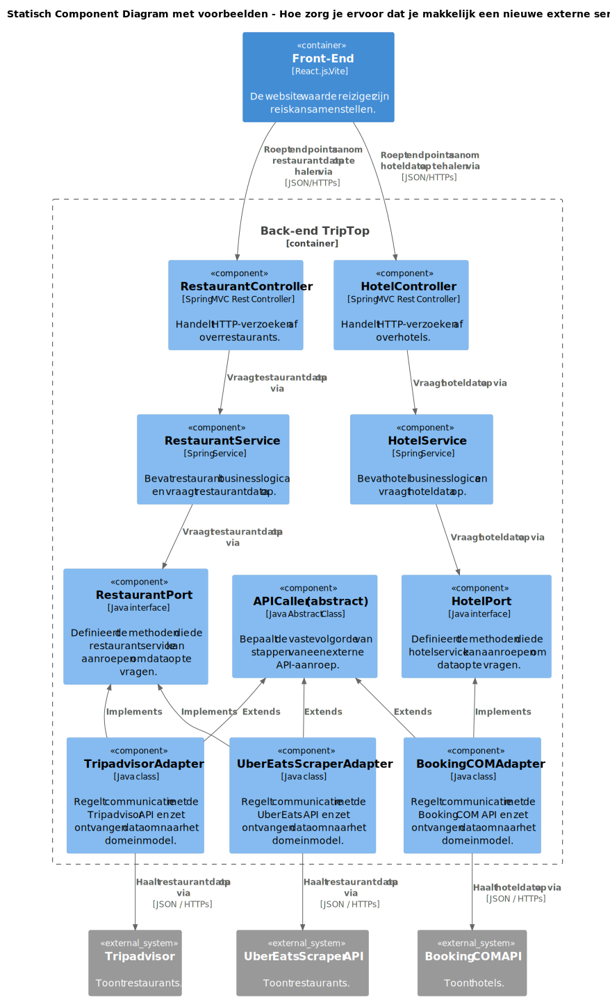

# Bijlage A - Voorbeeld toevoegen van een externe service en stappenplan

Om te verduidelijken hoe andere externe services kunnen worden toegevoegd, hebben we een diagram gemaakt waar, als voorbeeld, een tweede externe restaurantservice (Tripadvisor) is toegevoegd en een externe hotelservice (Booking COM).

## Overzicht
Om een tweede restaurantservice toe te voegen (feature bestaat al), hoeft er alleen een adapter voor de externe service aangemaakt te worden die de bestaande `RestaurantPort` implementeert en de `APICaller` extend. In `RestaurantService` hoeft geen code aangepast te worden en deze blijft gebruik maken van dezelfde `RestaurantPort`.

Om een hotelservice toe te voegen (nieuwe feature), moet er een `HotelController` en `HotelService` aangemaakt worden, met een eigen interface (HotelPort). Ook moet er een nieuwe adapterklasse (BookingCOMAdapter) gemaakt worden die deze interface implementeert en `APICaller` extend. In het prototype is een voorbeelduitwerking te vinden van het toevoegen van de nieuwe hotelfeature. Het uitbreiden van de bestaande restaurantfeature met een nieuwe externe service is niet uitgewerkt i.v.m. de beperkte duur van het project.

<!-- gedetailleerde uitleg stappenplan toevoegen nieuwe feature -->